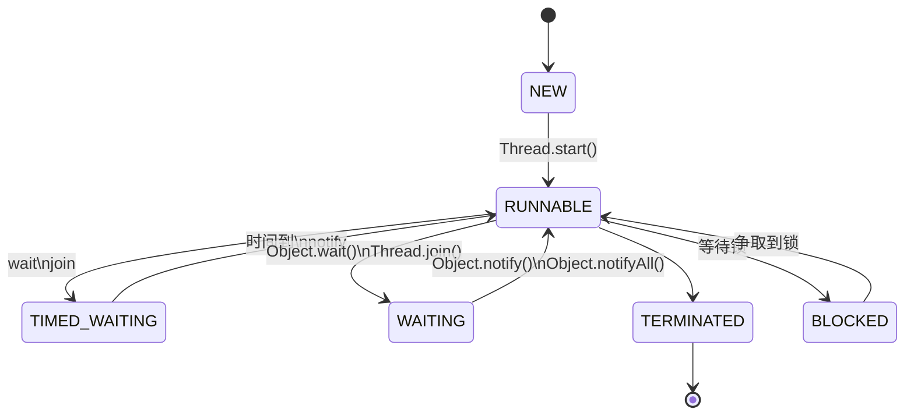

# Java并发编程

- [Java并发编程](#java并发编程)
  - [一、基础](#一基础)
    - [1. Java中使用线程](#1-java中使用线程)
      - [1.1 Thread类和Runnable接口](#11-thread类和runnable接口)
      - [1.2 Callable、Future与FutureTask](#12-callablefuture与futuretask)
    - [2. 线程的状态及转换](#2-线程的状态及转换)
      - [2.1 操作系统中的线程状态切换](#21-操作系统中的线程状态切换)
      - [2.2 Java中线程状态的切换](#22-java中线程状态的切换)
        - [NEW](#new)
        - [RUNNABLE](#runnable)
        - [BLOCKED](#blocked)
        - [WAITING](#waiting)
        - [TIMED_WAITING](#timed_waiting)
        - [TERMINATED](#terminated)
    - [3. 线程间通信](#3-线程间通信)
      - [3.1 锁与同步](#31-锁与同步)
      - [3.2 等待/通知机制](#32-等待通知机制)
      - [3.3 管道输入/输出流](#33-管道输入输出流)
      - [3.4 Thread.join()](#34-threadjoin)
      - [3.5 ThreadLocal()](#35-threadlocal)
  - [二、实践](#二实践)
    - [1. 线程池](#1-线程池)
      - [1.1 Java线程池原理](#11-java线程池原理)
        - [1.1.1 构造](#111-构造)
        - [1.1.2 任务处理流程](#112-任务处理流程)
        - [1.1.3 线程池如何复用线程](#113-线程池如何复用线程)
      - [1.2 四种常见线程池](#12-四种常见线程池)
    - [2. 阻塞队列](#2-阻塞队列)
    - [3. 原子操作类](#3-原子操作类)
  - [三、原理](#三原理)

最初的计算机只能接受一些特定的指令，用户每输入一个指令，计算机就做出一个操作。
为充分利用计算机CPU:

1. 批处理操作系统

   把一系列需要操作的指令写下来，形成一个清单，一次性交给计算机。内存中始终只有一个程序在运行，效率仍不高。

2. 进程

   进程就是应用程序在内存中分配的空间，也就是正在运行的程序，各个进程之间互不干扰。同时进程保存着程序每一个时刻运行的状态。

   > 程序：用某种编程语言(java、python等)编写，能够完成一定任务或者功能的代码集合,是指令和数据的有序集合，是一段静态代码。

   此时，CPU采用时间片轮转的方式运行进程：CPU为每个进程分配一个时间段，称作它的时间片。如果在时间片结束时进程还在运行，则暂停这个进程的运行，并且CPU分配给另一个进程（这个过程叫做上下文切换）。如果进程在时间片结束前阻塞或结束，则CPU立即进行切换，不用等待时间片用完。

   进程+CPU时间片轮转方式的操作系统，在宏观上看起来同一时间段执行多个任务，换句话说，进程让操作系统的**并发**成为了可能。虽然并发从宏观上看有多个任务在执行，但在事实上，**对于单核CPU来说，任意具体时刻都只有一个任务在占用CPU资源**。

3. 线程

   在进程中，让一个线程执行一个子任务，这样一个进程就包含了多个线程，每个线程负责一个单独的子任务。进程让操作系统的并发性成为了可能，而线程让进程的内部并发成为了可能。

   - 进程间相互隔离，通信不方便。线程共享进程资源，通信简单
   - 进程切换是重量级的，而线程是轻量级的

   > 进程和线程的区别
   >
   > 1. 进程内存隔离的，线程共享进程占有的内存空间和资源
   > 2. 进程间影响小，线程间影响大，一个线程可能影响整个程序稳定性
   > 3. 进程是操作系统进行资源分配的基本单位，而线程是操作系统进行调度的基本单位，即CPU分配时间的单位。

4. 协程(Coroutine)

   

   一个协程代表一个具体的任务，一个线程内部可包含一组协程队列，换句话说，协程运行在线程之上，线程是协程的运行环境。协程非常适用于处理 I/O 密集型任务，这是因为协程的上下文切换无需由内核调度介入，同时也不会发生系统调用，因此，任务可获得大量的 CPU 时间。

   在网络编程（BIO）场景下，服务端往往需要为每一个 Sokect 都创建一个线程来避免产生 I/O 阻塞，尽管常见的解决方案是使用更为复杂的 NIO 模型，但如果基于协程，我们完全可以将由上千个线程完成的任务，替换为 1 个线程和上千个协程来处理。

   

> 上下文切换
>
> 将上一个任务的 CPU 上下文信息保存到系统内核中，然后加载新任务的上下文信息至 CPU 寄存器，待上一个任务被系统内核调度时再重新从系统内核中加载进 CPU 寄存器内继续执行，同一时刻 CPU 寄存器仅会独享一个任务

## 一、基础

### 1. Java中使用线程

#### 1.1 Thread类和Runnable接口

JDK提供了```Thread```类和```Runnable```接口来让我们实现自己的“线程”类。

```java
/* 我们在程序里面调用了start()方法后，虚拟机会先为我们创建一个线程，然后等到这个线程第一次得到时间片时再调用run()方法。

注意不可多次调用start()方法。在第一次调用start()方法后，再次调用start()方法会抛出IllegalThreadStateException异常。*/

public class Demo {
    // 继承
    public static class MyThread extends Thread {
        @Override
        public void run() {
            System.out.println("MyThread");
        }
    }

    public static void main(String[] args) {
        Thread myThread = new MyThread();
        myThread.start();

        // Java 8 函数式编程，可以省略MyThread类
        new Thread(() -> {
            System.out.println("Java 8 匿名内部类");
        }).start();
    }
}
```

继承Thread和实现Runnable接口比较（类接口比较）：

- 由于Java“单继承，多实现”的特性，Runnable接口使用起来比Thread更灵活。
- Runnable接口出现更符合面向对象，将线程单独进行对象的封装。
- Runnable接口出现，降低了线程对象和线程任务的耦合性。
- 如果使用线程时不需要使用Thread类的诸多方法，显然使用Runnable接口更为轻量。

#### 1.2 Callable、Future与FutureTask

```run```方法是没有返回值的。而有时候我们希望开启一个线程去执行一个任务，并且这个任务执行完成后有一个返回值。

JDK提供了```Callable```接口与```Future```接口为我们解决这个问题，这也是所谓的“异步”模型。

```java
class Task implements Callable<Integer>{
    @Override
    public Integer call() throws Exception {
        // 模拟计算需要一秒
        Thread.sleep(1000);
        return 2;
    }
    public static void main(String args[]) throws Exception {
        // 使用线程池执行y
        ExecutorService executor = Executors.newCachedThreadPool();
        FutureTask<Integer> futureTask = new FutureTask<>(new Task());
        executor.submit(futureTask);
        System.out.println(futureTask.get());
    }
}
```

另外```Future```接口中增加了额外的线程操作方法

```java
public abstract interface Future<V> {
    // 试图取消一个线程的执行， 不一定成功
    public abstract boolean cancel(boolean paramBoolean);
    // 判断线程是否取消
    public abstract boolean isCancelled();
    // 判断线程是否执行完成
    public abstract boolean isDone();
    // 阻塞获取结果
    public abstract V get() throws InterruptedException, ExecutionException;
    // 有限时间内获取线程结果
    public abstract V get(long paramLong, TimeUnit paramTimeUnit)
            throws InterruptedException, ExecutionException, TimeoutException;
}
```

### 2. 线程的状态及转换

#### 2.1 操作系统中的线程状态切换

> 在现在的操作系统中，线程是被视为轻量级进程的，所以操作系统线程的状态其实和操作系统进程的状态是一致的。


操作系统线程主要有以下三个状态：

- 就绪状态(ready)：线程正在等待使用CPU，经调度程序调用之后可进入running状态。
- 执行状态(running)：线程正在使用CPU。
- 等待状态(waiting): 线程经过等待事件的调用或者正在等待其他资源（如I/O）。

#### 2.2 Java中线程状态的切换

```java
// java.lang.Thread.State 源码
public enum State {
    NEW,
    RUNNABLE,
    BLOCKED,
    WAITING,
    TIMED_WAITING,
    TERMINATED;
}
```

##### NEW

新建但是未启动的线程状态为NEW

```java
    @Test
    public void stateTest() {
        Thread thread = new Thread(() -> {

        });
        // NEW
        System.out.println(thread.getState());
    }
```

##### RUNNABLE

表示当前线程正在运行中。**处于RUNNABLE状态的线程在Java虚拟机中运行，也有可能在等待CPU分配资源。**

> Java线程的RUNNABLE状态其实是包括了传统操作系统线程的ready和running两个状态的。

##### BLOCKED

阻塞状态。处于BLOCKED状态的线程正等待锁的释放以进入同步区。

##### WAITING

等待状态。处于等待状态的线程变成RUNNABLE状态需要其他线程唤醒。

调用如下3个方法会使线程进入等待状态：

- Object.wait()：使当前线程处于等待状态直到另一个线程唤醒它；
- Thread.join()：等待线程执行完毕，底层调用的是Object实例的wait方法；
- LockSupport.park()：除非获得调用许可，否则禁用当前线程进行线程调度。

##### TIMED_WAITING

超时等待状态。线程等待一个具体的时间，时间到后会被自动唤醒, 拥有了争夺锁的资格。

调用如下方法会使线程进入超时等待状态：

- Thread.sleep(long millis)：使当前线程睡眠指定时间；
- Object.wait(long timeout)：线程休眠指定时间，等待期间可以通过notify()/notifyAll()唤醒；
- Thread.join(long millis)：等待当前线程最多执行millis毫秒，如果millis为0，则会一直执行；
- LockSupport.parkNanos(long nanos)： 除非获得调用许可，否则禁用当前线程进行线程调度指定时间；
- LockSupport.parkUntil(long deadline)：同上，也是禁止线程进行调度指定时间

##### TERMINATED

终止状态。此时线程已执行完毕。



### 3. 线程间通信

当多个线程同时运行时，线程的调度由操作系统决定，程序本身无法决定。因此，任何一个线程都有可能在任何指令处被操作系统暂停，然后在某个时间段后继续执行。

这个时候，有个单线程模型下不存在的问题就来了：如果多个线程同时读写共享变量，会出现数据不一致的问题。

```java
    int i = 0;

    @Test
    public void concurrentAddTest() throws InterruptedException {
        Thread t1 = new Thread(() -> {
            for (int i1 = 0; i1 < 10; i1++) {
                try {
                    Thread.sleep(100);
                } catch (InterruptedException e) {
                    e.printStackTrace();
                }
                i++;
            }
        });

        Thread t2 = new Thread(() -> {
            for (int i1 = 0; i1 < 10; i1++) {
                try {
                    Thread.sleep(100);
                } catch (InterruptedException e) {
                    e.printStackTrace();
                }
                i++;
            }
        });
        t1.start();
        t2.start();
        t1.join();
        t2.join();

        // 期望输出20 大概率小于20
        System.out.println(i);
    }
```

#### 3.1 锁与同步

声明了一个名字为lock的对象锁。我们在t1和t2内需要同步的代码块里，都是用synchronized关键字加上了同一个对象锁lock。

```java
    int i = 0;

    @Test
    public void concurrentAddTest() throws InterruptedException {
        Object lock = new Object();
        Thread t1 = new Thread(new Runnable() {
            @SneakyThrows
            @Override
            public void run() {
                for (int i1 = 0; i1 < 10; i1++) {
                    Thread.sleep(100);
                    synchronized (lock) {
                        i++;
                    }
                }
            }
        });

        Thread t2 = new Thread(new Runnable() {
            @SneakyThrows
            @Override
            public void run() {
                for (int i1 = 0; i1 < 10; i1++) {
                    Thread.sleep(100);
                    synchronized (lock) {
                        i++;
                    }
                }
            }
        });
        t1.start();
        t2.start();
        t1.join();
        t2.join();

        // 输出20
        System.out.println(i);
    }
```

#### 3.2 等待/通知机制

一个线程修改了一个对象的值，而另一个线程感知到了变化，然后进行相应的操作，整个过程开始于一个线程，而最终执行又是另一个线程。前者是生产者，后者就是消费者，这种模式隔离了“做什么”（what）和“怎么做”（How），在功能层面上实现了解耦，体系结构上具备了良 好的伸缩性，但是在Java语言中如何实现类似的功能呢？

基于Object类的wait()方法和notify(), notifyAll()方法来实现

|作用|方法签名|
|:----|:--|
|notify() | 通知一个对在象锁上等待的线程,使其从wait()方法返回,而返回的前提是那个线程获取到了对象的锁|
|notifyAll() | 通知所有等待在该对象上的线程|
|wait() | 调用该方法的线程进入WAITING状态, 只有等待另外线程的通知或中断才会返回.**调用wait会释放对象的锁** |
|wait(long) | 超时等待一段时间, 如果没有通知就超时返回 |
|wait(long, int) | 更细粒度的控制|

```java
public class WaitAndNotify {
    private static Object lock = new Object();

    static class ThreadA implements Runnable {
        @Override
        public void run() {
            synchronized (lock) {
                for (int i = 0; i < 5; i++) {
                    try {
                        System.out.println("ThreadA: " + i);
                        lock.notify();
                        lock.wait();
                    } catch (InterruptedException e) {
                        e.printStackTrace();
                    }
                }
                lock.notify();
            }
        }
    }

    static class ThreadB implements Runnable {
        @Override
        public void run() {
            synchronized (lock) {
                for (int i = 0; i < 5; i++) {
                    try {
                        System.out.println("ThreadB: " + i);
                        lock.notify();
                        lock.wait();
                    } catch (InterruptedException e) {
                        e.printStackTrace();
                    }
                }
                lock.notify();
            }
        }
    }

    public static void main(String[] args) throws InterruptedException {
        new Thread(new ThreadA()).start();
        Thread.sleep(1000);
        new Thread(new ThreadB()).start();
    }
}

```

先让ThreadA执行后, sleep一会防止ThreadB更早执行

```tex
// 输出：
ThreadA: 0
ThreadB: 0
ThreadA: 1
ThreadB: 1
ThreadA: 2
ThreadB: 2
ThreadA: 3
ThreadB: 3
ThreadA: 4
ThreadB: 4
```

#### 3.3 管道输入/输出流

> 由于使用场景少，按下不表

#### 3.4 Thread.join()

如果一个线程A执行了```thread.join()```语句，其含义是：当前线程A等待thread线程终止之后才从thread.join()返回。

```java
        Thread t1 = new Thread(() -> {
            System.out.println("i am running  " + Thread.currentThread().getName());
            try {
                Thread.sleep(100);
            } catch (InterruptedException e) {
                e.printStackTrace();
            }
            System.out.println("i am done  " + Thread.currentThread().getName());
        });
        t1.start();
        System.out.println("i am done  " + Thread.currentThread().getName());
        // 输出
        //i am done  main
        //i am running  Thread-0
```

发现线程t1还未执行完成程序就已经终止，为保证所有代码端都可正确执行，让t1```join```在主线程前

```java
        Thread t1 = new Thread(() -> {
            System.out.println("i am running  " + Thread.currentThread().getName());
            try {
                Thread.sleep(100);
            } catch (InterruptedException e) {
                e.printStackTrace();
            }
            System.out.println("i am done  " + Thread.currentThread().getName());
        });
        t1.start();
        t1.join();
        System.out.println("i am done  " + Thread.currentThread().getName());
        // 输出结果
        //i am running  Thread-0
        //i am done  Thread-0
        //i am done  main

```

#### 3.5 ThreadLocal()

ThreadLocal，即线程变量，是一个以ThreadLocal对象为键、任意对象为值的存储结构。这个结构被附带在线程上，也就是说一个线程可以根据一个ThreadLocal对象查询到绑定在这个线程上的一个值。

ThreadLocal类并不属于多线程间的通信，而是让每个线程有自己”独立“的变量，线程之间互不影响。它为每个线程都创建一个副本，每个线程可以访问自己内部的副本变量。

```java
    public static class Profiler {
        // 第一次get()方法调用时会进行初始化（如果set方法没有调用），每个线程会调用一次
        private static final ThreadLocal<Long> TIME_THREAD_LOCAL = ThreadLocal.withInitial(System::currentTimeMillis);

        public static void begin() {
            TIME_THREAD_LOCAL.set(System.currentTimeMillis());
        }

        public static long end() {
            return System.currentTimeMillis() - TIME_THREAD_LOCAL.get();
        }

        public static void main(String[] args) throws Exception {
            Profiler.begin();
            TimeUnit.SECONDS.sleep(1);
            System.out.println("Cost: " + Profiler.end() + " mills");
        }
    }
```

Profiler可以被复用在方法调用耗时统计的功能上，在方法的入口前执行begin()方法，在方法调用后执行end()方法，好处是两个方法的调用不用在一个方法或者类中，比如在AOP（面向方面编程）中，可以在方法调用前的切入点执行begin()方法，而在方法调用后的切入点执行end()方法，这样依旧可以获得方法的执行耗时。

如果开发者希望将类的某个静态变量（user ID或者transaction ID）与线程状态关联，则可以考虑使用ThreadLocal。

```java
// 引擎实践代码， Threadlocal共享变量
public abstract class ModuleBase{
    // 声明线程全局变量
    protected static final TransmittableThreadLocal<GlobleData> currentGDHolder = new TransmittableThreadLocal<>();

    // 避免传参的方式，线程内共享变量
    public static <GD> GD getGlobalData(){
        return (GD) currentGDHolder.get();
    }

}
```

## 二、实践

### 1. 线程池

在开发过程中，合理地使用线程池能够带来3个好处。

1. 降低资源消耗。通过重复利用已创建的线程降低线程创建和销毁造成的消耗。
2. 提高响应速度。当任务到达时，任务可以不需要等到线程创建就能立即执行。
3. 提高线程的可管理性。线程是稀缺资源，如果无限制地创建，不仅会消耗系统资源，还会降低系统的稳定性，使用线程池可以进行统一分配、调优和监控。

#### 1.1 Java线程池原理

Java中的线程池顶层接口是Executor接口，ThreadPoolExecutor是这个接口的实现类。

##### 1.1.1 构造

```java
// 七个参数的构造函数
public ThreadPoolExecutor(int corePoolSize,
                          int maximumPoolSize,
                          long keepAliveTime,
                          TimeUnit unit,
                          BlockingQueue<Runnable> workQueue,
                          // 可不填
                          ThreadFactory threadFactory,
                          // 可不填
                          RejectedExecutionHandler handler)
```

1. corePoolSize:核心线程个数，线程池存在这些核心线程就存在，非核心线程干完活后会被回收掉
2. maximumPoolSize:线程池中最大线程总数
3. keepAliveTime:非核心线程闲置超时时长
4. unit:keepAliveTime单位
5. workQueue:阻塞队列，维护着等待执行的Runnable任务对象
6. threadFactory:非必须参数，线程创建时使用的工厂类，可以用来设置线程优先级、是否守护线程，还可以为线程池指定名称，方便排查问题。如果没有指定，会使用默认Factory

    ```java
    static class DefaultThreadFactory implements ThreadFactory {

        DefaultThreadFactory() {
            SecurityManager s = System.getSecurityManager();
            group = (s != null) ? s.getThreadGroup() :
                                  Thread.currentThread().getThreadGroup();
            namePrefix = "pool-" +
                          poolNumber.getAndIncrement() +
                         "-thread-";
        }
    }
    ```

7. handler:非必须参数，拒绝处理策略，线程数量大于最大线程数就会采用拒绝处理策略，四种拒绝处理的策略为:

    1. ThreadPoolExecutor.AbortPolicy：**默认拒绝处理策略**，丢弃任务并抛出RejectedExecutionException异常。
    2. ThreadPoolExecutor.DiscardPolicy：丢弃新来的任务，**但是不抛出异常**。
    3. ThreadPoolExecutor.DiscardOldestPolicy：丢弃队列头部（最旧的）的任务，然后重新尝试执行程序（如果再次失败，重复此过程）。
    4. ThreadPoolExecutor.CallerRunsPolicy：由调用线程处理该任务。

> Q:什么时候线程池才会在核心线程基础上，创建非核心线程？核心线程被占满还是其他情况？
>
> A:
>
> Q: 队列满的时候，继续提交异步任务，会触发拒绝策略吗？
>
> A: 不一定

##### 1.1.2 任务处理流程

一般使用``submit()``向线程池中提交获取结果异步任务，使用``execute()``方法提交无需获取结果的异步任务，最终都会调用``execute()``：

```java
    public Future<?> submit(Runnable task) {
        if (task == null) throw new NullPointerException();
        RunnableFuture<Void> ftask = newTaskFor(task, null);
        execute(ftask);
        return ftask;
    }

```

着重分析下``execute()``方法：

```java
public void execute(Runnable command) {
    if (command == null)
        throw new NullPointerException();   
    int c = ctl.get();
    // 1.当前线程数小于corePoolSize,则调用addWorker创建核心线程执行任务
    if (workerCountOf(c) < corePoolSize) {
       if (addWorker(command, true))
           return;
       c = ctl.get();
    }
    // 2.如果不小于corePoolSize，则将任务添加到workQueue队列。
    if (isRunning(c) && workQueue.offer(command)) {
        int recheck = ctl.get();
        // 2.1 如果isRunning返回false(状态检查)，则remove这个任务，然后执行拒绝策略。
        if (!isRunning(recheck) && remove(command))
            reject(command);
            // 2.2 线程池处于running状态，但是没有线程，则创建线程
        else if (workerCountOf(recheck) == 0)
            addWorker(null, false);
    }
    // 3.如果放入workQueue失败，则创建非核心线程执行任务，
    // 如果这时创建非核心线程失败(当前线程总数不小于maximumPoolSize时)，就会执行拒绝策略。
    else if (!addWorker(command, false))
         reject(command);
}
```

1. 如果当前运行的线程少于corePoolSize，则创建新线程来执行任务（注意，执行这一步骤需要获取全局锁，``addWork()``需要判断线程池状态）。
2. 如果运行的线程等于或多于corePoolSize，则将任务加入BlockingQueue。我们仍然需要仔细检查是否应该添加一个线程（因为现有线程自上次检查后就死掉了）或自从进入该方法以来该池已关闭。因此，我们重新检查状态，并在必要时回滚排队（如果已停止），或者在没有线程的情况下启动新线程。
3. 如果无法将任务加入BlockingQueue（队列已满），则创建新的线程来处理任务
4. 如果创建新线程将使当前运行的线程超出maximumPoolSize，任务将被拒绝，并调用 RejectedExecutionHandler.rejectedExecution()方法


##### 1.1.3 线程池如何复用线程

在``execute()``方法中，关键是调用```addWork()```方法创建线程方法

```java
    private final class Worker
        extends AbstractQueuedSynchronizer
        implements Runnable
    {
        /**
         * This class will never be serialized, but we provide a
         * serialVersionUID to suppress a javac warning.
         */
        private static final long serialVersionUID = 6138294804551838833L;

        /** Thread this worker is running in.  Null if factory fails. */
        final Thread thread;
        /** Initial task to run.  Possibly null. */
        Runnable firstTask;
        /** Per-thread task counter */
        volatile long completedTasks;

        /**
         * Creates with given first task and thread from ThreadFactory.
         * @param firstTask the first task (null if none)
         */
        Worker(Runnable firstTask) {
            setState(-1); // inhibit interrupts until runWorker
            this.firstTask = firstTask;
            this.thread = getThreadFactory().newThread(this);
        }

        /** Delegates main run loop to outer runWorker  */
        public void run() {
            runWorker(this);
        }
    }
```

从构造方法中可以看到Work包装了线程，并持有线程引用，故线程任务就是Work自身。在``runWorker()``有核心运行方法

```java
final void runWorker(Worker w) {
    Thread wt = Thread.currentThread();
    Runnable task = w.firstTask;
    w.firstTask = null;
    // 1.线程启动之后，通过unlock方法释放锁
    w.unlock(); // allow interrupts
    boolean completedAbruptly = true;
    try {
        // 2.Worker执行firstTask或从workQueue中获取任务，如果getTask方法不返回null,循环不退出
        while (task != null || (task = getTask()) != null) {
            // 2.1进行加锁操作，保证thread不被其他线程中断（除非线程池被中断）
            w.lock();
            // If pool is stopping, ensure thread is interrupted;
            // if not, ensure thread is not interrupted.  This
            // requires a recheck in second case to deal with
            // shutdownNow race while clearing interrupt
            // 2.2检查线程池状态，倘若线程池处于中断状态，当前线程将中断。 
            if ((runStateAtLeast(ctl.get(), STOP) ||
                 (Thread.interrupted() &&
                  runStateAtLeast(ctl.get(), STOP))) &&
                !wt.isInterrupted())
                wt.interrupt();
            try {
                // 2.3执行beforeExecute 
                beforeExecute(wt, task);
                Throwable thrown = null;
                try {
                    // 2.4执行任务
                    task.run();
                } catch (RuntimeException x) {
                    thrown = x; throw x;
                } catch (Error x) {
                    thrown = x; throw x;
                } catch (Throwable x) {
                    thrown = x; throw new Error(x);
                } finally {
                    // 2.5执行afterExecute方法 
                    afterExecute(task, thrown);
                }
            } finally {
                task = null;
                w.completedTasks++;
                // 2.6解锁操作
                w.unlock();
            }
        }
        completedAbruptly = false;
    } finally {
        processWorkerExit(w, completedAbruptly);
    }
}
```

在while循环中，worker会不断地调用``getTask()``方法从阻塞队列中获取任务然后调用``task.run()``执行任务,从而达到复用线程的目的。只要``getTask``方法不返回null,此线程就不会退出。

当然，核心线程池中创建的线程想要拿到阻塞队列中的任务，先要判断线程池的状态，如果STOP或者TERMINATED，返回null。

```java
// Worker.getTask方法源码
private Runnable getTask() {
    boolean timedOut = false; // Did the last poll() time out?

    for (;;) {
        int c = ctl.get();
        int rs = runStateOf(c);

        // Check if queue empty only if necessary.
        if (rs >= SHUTDOWN && (rs >= STOP || workQueue.isEmpty())) {
            decrementWorkerCount();
            return null;
        }

        int wc = workerCountOf(c);

        // Are workers subject to culling?
        // 1.allowCoreThreadTimeOut变量默认是false,核心线程即使空闲也不会被销毁
        // 如果为true,核心线程在keepAliveTime内仍空闲则会被销毁。 
        boolean timed = allowCoreThreadTimeOut || wc > corePoolSize;
        // 2.如果运行线程数超过了最大线程数，但是缓存队列已经空了，这时递减worker数量。 
　　　　 // 如果有设置允许线程超时或者线程数量超过了核心线程数量，
        // 并且线程在规定时间内均未poll到任务且队列为空则递减worker数量
        if ((wc > maximumPoolSize || (timed && timedOut))
            && (wc > 1 || workQueue.isEmpty())) {
            if (compareAndDecrementWorkerCount(c))
                return null;
            continue;
        }

        try {
            // 3.如果timed为true(想想哪些情况下timed为true),则会调用workQueue的poll方法获取任务.
            // 超时时间是keepAliveTime。如果超过keepAliveTime时长，
            // poll返回了null，上边提到的while循序就会退出，线程也就执行完了。
            // 如果timed为false（allowCoreThreadTimeOut为falsefalse
            // 且wc > corePoolSize为false），则会调用workQueue的take方法阻塞在当前。
            // 队列中有任务加入时，线程被唤醒，take方法返回任务，并执行。
            Runnable r = timed ?
                workQueue.poll(keepAliveTime, TimeUnit.NANOSECONDS) :
                workQueue.take();
            if (r != null)
                return r;
            timedOut = true;
        } catch (InterruptedException retry) {
            timedOut = false;
        }
    }
}
```

核心线程的会一直卡在workQueue.take方法，被阻塞并挂起，不会占用CPU资源，直到拿到Runnable然后返回（当然如果**allowCoreThreadTimeOut**设置为true,那么核心线程就会去调用poll方法，因为poll可能会返回null,所以这时候核心线程满足超时条件也会被销毁）。

非核心线程会workQueue.poll(keepAliveTime, TimeUnit.NANOSECONDS) ，如果超时还没有拿到，下一次循环判断**compareAndDecrementWorkerCount**就会返回null,Worker对象的run()方法循环体的判断为null,任务结束，然后线程被系统回收 。

> Q: workQueue如何做到非阻塞获取队列中元素的呢？ Condition While 读写锁

#### 1.2 四种常见线程池

1. newCachedThreadPool
   ```java
   public static ExecutorService newCachedThreadPool() {
    return new ThreadPoolExecutor(0, Integer.MAX_VALUE,
                                  60L, TimeUnit.SECONDS,
                                  new SynchronousQueue<Runnable>());
    }
   ```
   - corePoolSize为0的关系，不创建核心线程，线程池最大为Integer.MAX_VALUE，因此可能会创建大量非核心线程
   - 尝试将任务添加到SynchronousQueue队列
   - 如果SynchronousQueue入列成功，等待被当前运行的线程空闲后拉取执行。如果当前没有空闲线程，那么就创建一个非核心线程，然后从SynchronousQueue拉取任务并在当前线程执行
   
   如果SynchronousQueue已有任务在等待，入列操作将会阻塞
   当需要执行很多**短时间**的任务时，CacheThreadPool的**线程复用率**比较高， 会显著的提高性能。而且线程60s后会回收，意味着即使没有任务进来，CacheThreadPool并不会占用很多资源。

2. newFixedThreadPool
   ```java
   public static ExecutorService newFixedThreadPool(int nThreads) {
        return new ThreadPoolExecutor(nThreads, nThreads,
                                      0L, TimeUnit.MILLISECONDS,
                                      new LinkedBlockingQueue<Runnable>());
                                      }
   ```

   核心线程数量和总线程数量相等，都是传入的参数nThreads，所以只能创建核心线程，不能创建非核心线程。因为LinkedBlockingQueue的默认大小是Integer.MAX_VALUE，故如果核心线程空闲，则交给核心线程处理；如果核心线程不空闲，则入列等待，直到核心线程空闲。

3. newSingleThreadExecutor
   ```java
   public static ExecutorService newSingleThreadExecutor() {
    return new FinalizableDelegatedExecutorService
        (new ThreadPoolExecutor(1, 1,
                                0L, TimeUnit.MILLISECONDS,
                                new LinkedBlockingQueue<Runnable>()));
                                }
   ```
   
   有且仅有一个核心线程（ corePoolSize == maximumPoolSize=1），使用了LinkedBlockingQueue（容量很大），所以，不会创建非核心线程。所有任务按照先来先执行的顺序执行。如果这个唯一的线程不空闲，那么新来的任务会存储在任务队列里等待执行。

4. newScheduledThreadPool
   创建一个定长线程池，支持定时及周期性任务执行
   ```java
   public static ScheduledExecutorService newScheduledThreadPool(int corePoolSize) {
    return new ScheduledThreadPoolExecutor(corePoolSize);
    }

    //ScheduledThreadPoolExecutor():
    public ScheduledThreadPoolExecutor(int corePoolSize) {
        super(corePoolSize, Integer.MAX_VALUE,
            DEFAULT_KEEPALIVE_MILLIS, MILLISECONDS,
            new DelayedWorkQueue());
    }
   ```

> Q: Cached和Fixed异同点
> 1. 因为 corePoolSize == maximumPoolSize ，所以FixedThreadPool只会创建核心线程。 而CachedThreadPool因为corePoolSize=0，所以只会创建非核心线程
> 2. 在 getTask() 方法，如果队列里没有任务可取，线程会一直阻塞在 LinkedBlockingQueue.take() ，线程不会被回收。 CachedThreadPool会在60s后收回。
> 3. 由于线程不会被回收，会一直卡在阻塞，所以没有任务的情况下， FixedThreadPool占用资源更多
> 4. 都几乎不会触发拒绝策略，但是原理不同。FixedThreadPool是因为阻塞队列可以很大（最大为Integer最大值），故几乎不会触发拒绝策略；CachedThreadPool是因为线程池很大（最大为Integer最大值），几乎不会导致线程数量大于最大线程数，故几乎不会触发拒绝策略。

### 2. 阻塞队列

### 3. 原子操作类

## 三、原理
