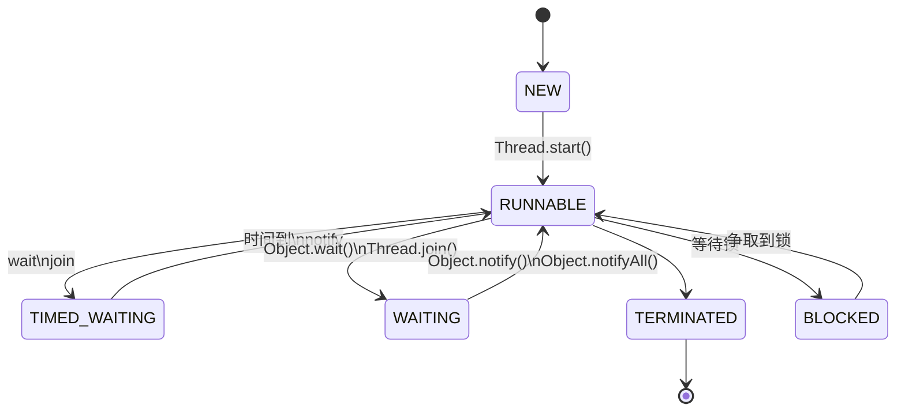
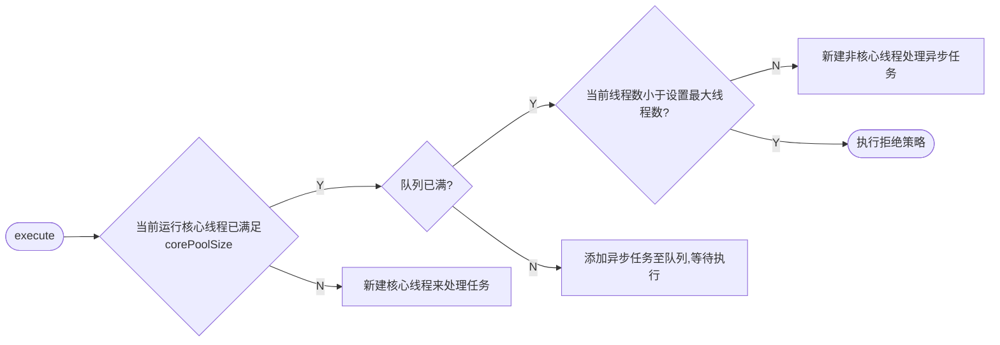

# Java并发编程

[toc]

最初的计算机只能接受一些特定的指令，用户每输入一个指令，计算机就做出一个操作。
为充分利用计算机CPU:

1. 批处理操作系统

   把一系列需要操作的指令写下来，形成一个清单，一次性交给计算机。内存中始终只有一个程序在运行，效率仍不高。

2. 进程

   进程就是应用程序在内存中分配的空间，也就是正在运行的程序，各个进程之间互不干扰。同时进程保存着程序每一个时刻运行的状态。

   > 程序：用某种编程语言(java、python等)编写，能够完成一定任务或者功能的代码集合,是指令和数据的有序集合，是一段静态代码。

   此时，CPU采用时间片轮转的方式运行进程：CPU为每个进程分配一个时间段，称作它的时间片。如果在时间片结束时进程还在运行，则暂停这个进程的运行，并且CPU分配给另一个进程（这个过程叫做上下文切换）。如果进程在时间片结束前阻塞或结束，则CPU立即进行切换，不用等待时间片用完。

   进程+CPU时间片轮转方式的操作系统，在宏观上看起来同一时间段执行多个任务，换句话说，进程让操作系统的**并发**成为了可能。虽然并发从宏观上看有多个任务在执行，但在事实上，**对于单核CPU来说，任意具体时刻都只有一个任务在占用CPU资源**。

3. 线程

   在进程中，让一个线程执行一个子任务，这样一个进程就包含了多个线程，每个线程负责一个单独的子任务。进程让操作系统的并发性成为了可能，而线程让进程的内部并发成为了可能。

   - 进程间相互隔离，通信不方便。线程共享进程资源，通信简单
   - 进程切换是重量级的，而线程是轻量级的

   > 进程和线程的区别
   >
   > 1. 进程内存隔离的，线程共享进程占有的内存空间和资源
   > 2. 进程间影响小，线程间影响大，一个线程可能影响整个程序稳定性
   > 3. 进程是操作系统进行资源分配的基本单位，而线程是操作系统进行调度的基本单位，即CPU分配时间的单位。

4. 协程(Coroutine)

   

   一个协程代表一个具体的任务，一个线程内部可包含一组协程队列，换句话说，协程运行在线程之上，线程是协程的运行环境。协程非常适用于处理 I/O 密集型任务，这是因为协程的上下文切换无需由内核调度介入，同时也不会发生系统调用，因此，任务可获得大量的 CPU 时间。

   在网络编程（BIO）场景下，服务端往往需要为每一个 Sokect 都创建一个线程来避免产生 I/O 阻塞，尽管常见的解决方案是使用更为复杂的 NIO 模型，但如果基于协程，我们完全可以将由上千个线程完成的任务，替换为 1 个线程和上千个协程来处理。

   

## 零、并发编程挑战

### 1.上下文切换

CPU通过时间片分配算法来循环执行任务，当前任务执行一个时间片后会切换到下一个任务。但是，在切换前会保存上一个任务的状态，以便下次切换回这个任务时，可以再加载这个任务的状态。所以任务从保存到再加载的过程就是一次上下文切换。

由于进行上下文切换时，需要保存当前线程的状态，并加载线程先前的状态，这是有消耗的，因此应该尽量减少上下文切换的次数。

* 减少线程的数量，避免创建不必要的线程。
* 采用无锁并发编程。采用一些办法避免使用锁，如将数据ID按照 Hash(id) 进行取模分段，每个线程处理各自分段的数据，避免使用锁。
* 采用 CAS 算法。 Java 的 Atomic 包使用 CAS 算法更新数据，不需要加锁。
* 协程。在单线程里实现多任务调度，并在单线程里维持多个任务间的切换。

### 2.死锁

产生死锁的原因主要是：

（1） 因为系统资源不足。

（2） 进程运行推进的顺序不合适。

（3） 资源分配不当等。

产生死锁的四个必要条件：

（1） 互斥条件：一个资源每次只能被一个进程使用。

（2） 请求与保持条件：一个进程因请求资源而阻塞时，对已获得的资源保持不放。

（3） 不可剥夺条件: 进程已获得的资源，在末使用完之前，不能强行剥夺。

（4） 循环等待条件: 若干进程之间形成一种头尾相接的循环等待资源关系。

这四个条件是死锁的必要条件，只要系统发生死锁，这些条件必然成立，而只要上述条件之一不满足，就不会发生死锁。

```java
public class DeadLock {

    static final Object lockA = new Object();
    static final Object lockB = new Object();

    public static void main(String[] args) {
        Thread thread1 = new Thread(() -> {
            System.out.println(Thread.currentThread() + "wait A");
            synchronized (lockA) {
                System.out.println(Thread.currentThread() + " thread has got A");
                try {
                    Thread.sleep(1000);
                } catch (InterruptedException e) {
                    e.printStackTrace();
                }
                System.out.println(Thread.currentThread() + "wait B");
                synchronized (lockB) {
                    System.out.println(Thread.currentThread() + "thread has got B");
                }
            }
        }, "thread1");
        Thread thread2 = new Thread(() -> {
            System.out.println(Thread.currentThread() + "wait B");
            synchronized (lockB) {
                System.out.println(Thread.currentThread() + " thread has got B");
                try {
                    Thread.sleep(1000);
                } catch (InterruptedException e) {
                    e.printStackTrace();
                }
                System.out.println(Thread.currentThread() + "wait A");
                synchronized (lockA) {
                    System.out.println(Thread.currentThread() + "thread has got A");
                }
            }
        }, "thread2");
        thread1.start();
        thread2.start();

        try {
            thread1.join();
            thread2.join();
        } catch (InterruptedException e) {
            e.printStackTrace();
        }
        System.out.println("main end");
    }
}
```

> 系统输出：
>
> Thread[thread2,5,main]wait B
> Thread[thread2,5,main] thread has got B
> Thread[thread1,5,main]wait A
> Thread[thread1,5,main] thread has got A
>
> 这里两个线程发生相互等待的死锁现象
>
> Thread[thread1,5,main]wait B
> Thread[thread2,5,main]wait A


解决办法，破坏不可剥夺条件，一个线程主动出让资源

```java
public class DeadLock {

    static final Object lockA = new Object();
    static final Object lockB = new Object();

    public static void main(String[] args) {
        Thread thread1 = new Thread(() -> {
            System.out.println(Thread.currentThread() + "wait A");
            synchronized (lockA) {
                System.out.println(Thread.currentThread() + " thread has got A");
                try {
                    Thread.sleep(1000);
                } catch (InterruptedException e) {
                    e.printStackTrace();
                }
                System.out.println(Thread.currentThread() + "wait B");
                synchronized (lockB) {
                    System.out.println(Thread.currentThread() + "thread has got B");
                    // 唤醒等待lockB的线程
                    lockB.notify();
                }
            }
        }, "thread1");
        Thread thread2 = new Thread(() -> {
            System.out.println(Thread.currentThread() + "wait B");
            synchronized (lockB) {
                System.out.println(Thread.currentThread() + " thread has got B");
                try {
                    Thread.sleep(1000);
                } catch (InterruptedException e) {
                    e.printStackTrace();
                }
                // 线程B主动出让，等待唤醒
                try {
                    lockB.wait();
                } catch (InterruptedException e) {
                    e.printStackTrace();
                }
                System.out.println(Thread.currentThread() + "wait A");
                synchronized (lockA) {
                    System.out.println(Thread.currentThread() + "thread has got A");
                }
            }
        }, "thread2");
        thread1.start();
        thread2.start();

        try {
            thread1.join();
            thread2.join();
        } catch (InterruptedException e) {
            e.printStackTrace();
        }
        System.out.println("main end");
    }
}
```

> Thread[thread1,5,main]wait A
> Thread[thread2,5,main]wait B
> Thread[thread1,5,main] thread has got A
> Thread[thread2,5,main] thread has got B
> Thread[thread1,5,main]wait B
> Thread[thread1,5,main]thread has got B
> Thread[thread2,5,main]wait A
> Thread[thread2,5,main]thread has got A
> main end

#### 死锁预防

除互斥条件外，可以通过破坏其他三个必要条件打到预防目的：

1. 破坏“请求与保持”条件
   方法一：静态分配，每个进程在开始执行时就申请他所需要的全部资源。
   方法二：动态分配，每个进程在申请所需要的资源时他本身不占用系统资源。

   如果哲学家**请求筷子失败便放下手中的持有的筷子去睡觉**，每次放下筷子都会叫醒旁边睡觉的哲学家让其再次尝试（或者我们让哲学家要么拿起两只筷子，要么睡觉等待其他哲学家放下筷子时叫醒），哲学家们会顺序的得到两只筷子并去吃饭。

2. 破坏“不可剥夺”条件
   一个进程不可获得其所需要的全部资源便处于等待状态，等待期间他占用的资源将被隐式的释放重新加入到系统的资源列表中，可以被其他进程使用，而等待的进程只有重新获得自己原有的资源以及新申请的资源才可以重新启动，执行。

   **将资源变为可以抢占的，哲学家可以互相抢筷子**。这个策略听起来可行，但并不普适。比如如果抢占的资源不是筷子而是锁，那么锁将失去其原有的语义，这样的后果是不堪设想的！

3. 破坏“循环等待”条件
   采用资源有序分配的基本思想。将系统中的资源顺序进行编号，将紧缺的、稀少的资源采用较大的编号，申请资源时必须按照编号的顺序执行，一个进程只有较小编号的进程才能申请较大编号的进程。 

   对于哲学家就餐问题，我们也可以通过规定拿筷子的顺序来打破循环等待。比如，**我们可以给哲学家编号，奇数号码的哲学家必须先拿左手边的筷子，偶数号码的哲学家必须先拿右手边的筷子**。

#### 死锁避免（**银行家算法**）

**动态避免算法便是在每次进行资源分配时，都需要仔细计算，确保该资源的申请不会使系统进入一个不安全状态。安全状态是指我们能够找到一种资源分配的方法和顺序，使每个在运行的线程都可以得到其需要的资源。如果资源的分配将使系统进入不安全状态，则拒绝。动态避免是一种在资源分配上下功夫的防止死锁的手段。**

### 3.资源限制

资源限制是指在进行并发编程时，程序的执行速度受限于计算机的硬件资源或者软件资源，这些计算机资源限制了程序的并发度。线程多了导致线程的上下文切换增多，资源有限，会产生损耗。

解决资源限制的方法：

* 对于硬件资源限制，考虑使用集群并行程序。
* 对于软件资源限制，可以考虑使用资源池对资源进行复用，如线程池和数据库连接池。

## 一、基础

### 1. Java中使用线程

#### 1.1 Thread类和Runnable接口

JDK提供了```Thread```类和```Runnable```接口来让我们实现自己的“线程”类。

```java
/* 我们在程序里面调用了start()方法后，虚拟机会先为我们创建一个线程，然后等到这个线程第一次得到时间片时再调用run()方法。

注意不可多次调用start()方法。在第一次调用start()方法后，再次调用start()方法会抛出IllegalThreadStateException异常。*/

public class Demo {
    // 继承
    public static class MyThread extends Thread {
        @Override
        public void run() {
            System.out.println("MyThread");
        }
    }

    public static void main(String[] args) {
        Thread myThread = new MyThread();
        myThread.start();

        // Java 8 函数式编程，可以省略MyThread类
        new Thread(() -> {
            System.out.println("Java 8 匿名内部类");
        }).start();
    }
}
```

继承Thread和实现Runnable接口比较（类接口比较）：

- 由于Java“单继承，多实现”的特性，Runnable接口使用起来比Thread更灵活。
- Runnable接口出现更符合面向对象，将线程单独进行对象的封装。
- Runnable接口出现，降低了线程对象和线程任务的耦合性。
- 如果使用线程时不需要使用Thread类的诸多方法，显然使用Runnable接口更为轻量。

#### 1.2 Callable、Future与FutureTask

```run```方法是没有返回值的。而有时候我们希望开启一个线程去执行一个任务，并且这个任务执行完成后有一个返回值。

JDK提供了```Callable```接口与```Future```接口为我们解决这个问题，这也是所谓的“异步”模型。

```java
class Task implements Callable<Integer>{
    @Override
    public Integer call() throws Exception {
        // 模拟计算需要一秒
        Thread.sleep(1000);
        return 2;
    }
    public static void main(String args[]) throws Exception {
        // 使用线程池执行y
        ExecutorService executor = Executors.newCachedThreadPool();
        FutureTask<Integer> futureTask = new FutureTask<>(new Task());
        executor.submit(futureTask);
        System.out.println(futureTask.get());
    }
}
```

另外```Future```接口中增加了额外的线程操作方法

```java
public abstract interface Future<V> {
    // 试图取消一个线程的执行， 不一定成功
    public abstract boolean cancel(boolean paramBoolean);
    // 判断线程是否取消
    public abstract boolean isCancelled();
    // 判断线程是否执行完成
    public abstract boolean isDone();
    // 阻塞获取结果
    public abstract V get() throws InterruptedException, ExecutionException;
    // 有限时间内获取线程结果
    public abstract V get(long paramLong, TimeUnit paramTimeUnit)
            throws InterruptedException, ExecutionException, TimeoutException;
}
```

### 2. 线程的状态及转换

#### 2.1 操作系统中的线程状态切换

> 在现在的操作系统中，线程是被视为轻量级进程的，所以操作系统线程的状态其实和操作系统进程的状态是一致的。


操作系统线程主要有以下三个状态：

- 就绪状态(ready)：线程正在等待使用CPU，经调度程序调用之后可进入running状态。
- 执行状态(running)：线程正在使用CPU。
- 等待状态(waiting): 线程经过等待事件的调用或者正在等待其他资源（如I/O）。

#### 2.2 Java中线程状态的切换

```java
// java.lang.Thread.State 源码
public enum State {
    NEW,
    RUNNABLE,
    BLOCKED,
    WAITING,
    TIMED_WAITING,
    TERMINATED;
}
```

##### NEW

新建但是未启动的线程状态为NEW

```java
    @Test
    public void stateTest() {
        Thread thread = new Thread(() -> {

        });
        // NEW
        System.out.println(thread.getState());
    }
```

##### RUNNABLE

表示当前线程正在运行中。**处于RUNNABLE状态的线程在Java虚拟机中运行，也有可能在等待CPU分配资源。**

> Java线程的RUNNABLE状态其实是包括了传统操作系统线程的ready和running两个状态的。

##### BLOCKED

阻塞状态。处于BLOCKED状态的线程正等待锁的释放以进入同步区。

##### WAITING

等待状态。处于等待状态的线程变成RUNNABLE状态需要其他线程唤醒。

调用如下3个方法会使线程进入等待状态：

- Object.wait()：使当前线程处于等待状态直到另一个线程唤醒它；
- Thread.join()：等待线程执行完毕，底层调用的是Object实例的wait方法；
- LockSupport.park()：除非获得调用许可，否则禁用当前线程进行线程调度。

##### TIMED_WAITING

超时等待状态。线程等待一个具体的时间，时间到后会被自动唤醒, 拥有了争夺锁的资格。

调用如下方法会使线程进入超时等待状态：

- Thread.sleep(long millis)：使当前线程睡眠指定时间；
- Object.wait(long timeout)：线程休眠指定时间，等待期间可以通过notify()/notifyAll()唤醒；
- Thread.join(long millis)：等待当前线程最多执行millis毫秒，如果millis为0，则会一直执行；
- LockSupport.parkNanos(long nanos)： 除非获得调用许可，否则禁用当前线程进行线程调度指定时间；
- LockSupport.parkUntil(long deadline)：同上，也是禁止线程进行调度指定时间

##### TERMINATED

终止状态。此时线程已执行完毕。



### 3. 线程间通信

当多个线程同时运行时，线程的调度由操作系统决定，程序本身无法决定。因此，任何一个线程都有可能在任何指令处被操作系统暂停，然后在某个时间段后继续执行。

这个时候，有个单线程模型下不存在的问题就来了：如果多个线程同时读写共享变量，会出现数据不一致的问题。

```java
    int i = 0;

    @Test
    public void concurrentAddTest() throws InterruptedException {
        Thread t1 = new Thread(() -> {
            for (int i1 = 0; i1 < 10; i1++) {
                try {
                    Thread.sleep(100);
                } catch (InterruptedException e) {
                    e.printStackTrace();
                }
                i++;
            }
        });

        Thread t2 = new Thread(() -> {
            for (int i1 = 0; i1 < 10; i1++) {
                try {
                    Thread.sleep(100);
                } catch (InterruptedException e) {
                    e.printStackTrace();
                }
                i++;
            }
        });
        t1.start();
        t2.start();
        t1.join();
        t2.join();

        // 期望输出20 大概率小于20
        System.out.println(i);
    }
```

#### 3.1 锁与同步

声明了一个名字为lock的对象锁。我们在t1和t2内需要同步的代码块里，都是用synchronized关键字加上了同一个对象锁lock。

```java
    int i = 0;

    @Test
    public void concurrentAddTest() throws InterruptedException {
        Object lock = new Object();
        Thread t1 = new Thread(new Runnable() {
            @SneakyThrows
            @Override
            public void run() {
                for (int i1 = 0; i1 < 10; i1++) {
                    Thread.sleep(100);
                    synchronized (lock) {
                        i++;
                    }
                }
            }
        });

        Thread t2 = new Thread(new Runnable() {
            @SneakyThrows
            @Override
            public void run() {
                for (int i1 = 0; i1 < 10; i1++) {
                    Thread.sleep(100);
                    synchronized (lock) {
                        i++;
                    }
                }
            }
        });
        t1.start();
        t2.start();
        t1.join();
        t2.join();

        // 输出20
        System.out.println(i);
    }
```

#### 3.2 等待/通知机制

一个线程修改了一个对象的值，而另一个线程感知到了变化，然后进行相应的操作，整个过程开始于一个线程，而最终执行又是另一个线程。前者是生产者，后者就是消费者，这种模式隔离了“做什么”（what）和“怎么做”（How），在功能层面上实现了解耦，体系结构上具备了良 好的伸缩性，但是在Java语言中如何实现类似的功能呢？

基于Object类的wait()方法和notify(), notifyAll()方法来实现

|作用|方法签名|
|:----|:--|
|notify() | 通知一个对在象锁上等待的线程,使其从wait()方法返回,而返回的前提是那个线程获取到了对象的锁|
|notifyAll() | 通知所有等待在该对象上的线程|
|wait() | 调用该方法的线程进入WAITING状态, 只有等待另外线程的通知或中断才会返回.**调用wait会释放对象的锁** |
|wait(long) | 超时等待一段时间, 如果没有通知就超时返回 |
|wait(long, int) | 更细粒度的控制|

```java
public class WaitAndNotify {
    private static Object lock = new Object();

    static class ThreadA implements Runnable {
        @Override
        public void run() {
            synchronized (lock) {
                for (int i = 0; i < 5; i++) {
                    try {
                        System.out.println("ThreadA: " + i);
                        lock.notify();
                        lock.wait();
                    } catch (InterruptedException e) {
                        e.printStackTrace();
                    }
                }
                lock.notify();
            }
        }
    }

    static class ThreadB implements Runnable {
        @Override
        public void run() {
            synchronized (lock) {
                for (int i = 0; i < 5; i++) {
                    try {
                        System.out.println("ThreadB: " + i);
                        lock.notify();
                        lock.wait();
                    } catch (InterruptedException e) {
                        e.printStackTrace();
                    }
                }
                lock.notify();
            }
        }
    }

    public static void main(String[] args) throws InterruptedException {
        new Thread(new ThreadA()).start();
        Thread.sleep(1000);
        new Thread(new ThreadB()).start();
    }
}

```

先让ThreadA执行后, sleep一会防止ThreadB更早执行

```tex
// 输出：
ThreadA: 0
ThreadB: 0
ThreadA: 1
ThreadB: 1
ThreadA: 2
ThreadB: 2
ThreadA: 3
ThreadB: 3
ThreadA: 4
ThreadB: 4
```

#### 3.3 管道输入/输出流

> 由于使用场景少，按下不表

#### 3.4 Thread.join()

如果一个线程A执行了```thread.join()```语句，其含义是：当前线程A等待thread线程终止之后才从thread.join()返回。

```java
        Thread t1 = new Thread(() -> {
            System.out.println("i am running  " + Thread.currentThread().getName());
            try {
                Thread.sleep(100);
            } catch (InterruptedException e) {
                e.printStackTrace();
            }
            System.out.println("i am done  " + Thread.currentThread().getName());
        });
        t1.start();
        System.out.println("i am done  " + Thread.currentThread().getName());
        // 输出
        //i am done  main
        //i am running  Thread-0
```

发现线程t1还未执行完成程序就已经终止，为保证所有代码端都可正确执行，让t1```join```在主线程前

```java
        Thread t1 = new Thread(() -> {
            System.out.println("i am running  " + Thread.currentThread().getName());
            try {
                Thread.sleep(100);
            } catch (InterruptedException e) {
                e.printStackTrace();
            }
            System.out.println("i am done  " + Thread.currentThread().getName());
        });
        t1.start();
        t1.join();
        System.out.println("i am done  " + Thread.currentThread().getName());
        // 输出结果
        //i am running  Thread-0
        //i am done  Thread-0
        //i am done  main

```

#### 3.5 ThreadLocal()

ThreadLocal，即线程变量，是一个以ThreadLocal对象为键、任意对象为值的存储结构。这个结构被附带在线程上，也就是说一个线程可以根据一个ThreadLocal对象查询到绑定在这个线程上的一个值。

ThreadLocal类并不属于多线程间的通信，而是让每个线程有自己”独立“的变量，线程之间互不影响。它为每个线程都创建一个副本，每个线程可以访问自己内部的副本变量。

```java
    public static class Profiler {
        // 第一次get()方法调用时会进行初始化（如果set方法没有调用），每个线程会调用一次
        private static final ThreadLocal<Long> TIME_THREAD_LOCAL = ThreadLocal.withInitial(System::currentTimeMillis);

        public static void begin() {
            TIME_THREAD_LOCAL.set(System.currentTimeMillis());
        }

        public static long end() {
            return System.currentTimeMillis() - TIME_THREAD_LOCAL.get();
        }

        public static void main(String[] args) throws Exception {
            Profiler.begin();
            TimeUnit.SECONDS.sleep(1);
            System.out.println("Cost: " + Profiler.end() + " mills");
        }
    }
```

Profiler可以被复用在方法调用耗时统计的功能上，在方法的入口前执行begin()方法，在方法调用后执行end()方法，好处是两个方法的调用不用在一个方法或者类中，比如在AOP（面向方面编程）中，可以在方法调用前的切入点执行begin()方法，而在方法调用后的切入点执行end()方法，这样依旧可以获得方法的执行耗时。

如果开发者希望将类的某个静态变量（user ID或者transaction ID）与线程状态关联，则可以考虑使用ThreadLocal。

```java
// 引擎实践代码， Threadlocal共享变量
public abstract class ModuleBase{
    // 声明线程全局变量
    protected static final TransmittableThreadLocal<GlobleData> currentGDHolder = new TransmittableThreadLocal<>();

    // 避免传参的方式，线程内共享变量
    public static <GD> GD getGlobalData(){
        return (GD) currentGDHolder.get();
    }

}
```

## 二、实践

### 1. 线程池

在开发过程中，合理地使用线程池能够带来3个好处。

1. 降低资源消耗。通过重复利用已创建的线程降低线程创建和销毁造成的消耗。
2. 提高响应速度。当任务到达时，任务可以不需要等到线程创建就能立即执行。
3. 提高线程的可管理性。线程是稀缺资源，如果无限制地创建，不仅会消耗系统资源，还会降低系统的稳定性，使用线程池可以进行统一分配、调优和监控。

#### 1.1 Java线程池原理

Java中的线程池顶层接口是Executor接口，ThreadPoolExecutor是这个接口的实现类。

##### 1.1.1 构造

```java
// 七个参数的构造函数
public ThreadPoolExecutor(int corePoolSize,
                          int maximumPoolSize,
                          long keepAliveTime,
                          TimeUnit unit,
                          BlockingQueue<Runnable> workQueue,
                          // 可不填
                          ThreadFactory threadFactory,
                          // 可不填
                          RejectedExecutionHandler handler)
```

1. corePoolSize:核心线程个数，线程池存在这些核心线程就存在，非核心线程干完活后会被回收掉
2. maximumPoolSize:线程池中最大线程总数
3. keepAliveTime:非核心线程闲置超时时长
4. unit:keepAliveTime单位
5. workQueue:阻塞队列，维护着等待执行的Runnable任务对象
6. threadFactory:非必须参数，线程创建时使用的工厂类，可以用来设置线程优先级、是否守护线程，还可以为线程池指定名称，方便排查问题。如果没有指定，会使用默认Factory

    ```java
    static class DefaultThreadFactory implements ThreadFactory {

        DefaultThreadFactory() {
            SecurityManager s = System.getSecurityManager();
            group = (s != null) ? s.getThreadGroup() :
                                  Thread.currentThread().getThreadGroup();
            namePrefix = "pool-" +
                          poolNumber.getAndIncrement() +
                         "-thread-";
        }
    }
    ```

7. handler:非必须参数，拒绝处理策略，线程数量大于最大线程数就会采用拒绝处理策略，四种拒绝处理的策略为:

    1. ThreadPoolExecutor.AbortPolicy：**默认拒绝处理策略**，丢弃任务并抛出RejectedExecutionException异常。
    2. ThreadPoolExecutor.DiscardPolicy：丢弃新来的任务，**但是不抛出异常**。
    3. ThreadPoolExecutor.DiscardOldestPolicy：丢弃队列头部（最旧的）的任务，然后重新尝试执行程序（如果再次失败，重复此过程）。
    4. ThreadPoolExecutor.CallerRunsPolicy：由调用线程处理该任务。

> Q:什么时候线程池才会在核心线程基础上，创建非核心线程？核心线程被占满还是其他情况？
>
> A:
>
> Q: 队列满的时候，继续提交异步任务，会触发拒绝策略吗？
>
> A: 不一定

##### 1.1.2 任务处理流程

一般使用``submit()``向线程池中提交获取结果异步任务，使用``execute()``方法提交无需获取结果的异步任务，最终都会调用``execute()``：

```java
    public Future<?> submit(Runnable task) {
        if (task == null) throw new NullPointerException();
        RunnableFuture<Void> ftask = newTaskFor(task, null);
        execute(ftask);
        return ftask;
    }

```

着重分析下``execute()``方法：

```java
public void execute(Runnable command) {
    if (command == null)
        throw new NullPointerException();   
    int c = ctl.get();
    // 1.当前线程数小于corePoolSize,则调用addWorker创建核心线程执行任务
    if (workerCountOf(c) < corePoolSize) {
       if (addWorker(command, true))
           return;
       c = ctl.get();
    }
    // 2.如果不小于corePoolSize，则将任务添加到workQueue队列。
    if (isRunning(c) && workQueue.offer(command)) {
        int recheck = ctl.get();
        // 2.1 如果isRunning返回false(状态检查)，则remove这个任务，然后执行拒绝策略。
        if (!isRunning(recheck) && remove(command))
            reject(command);
            // 2.2 线程池处于running状态，但是没有线程，则创建线程
        else if (workerCountOf(recheck) == 0)
            addWorker(null, false);
    }
    // 3.如果放入workQueue失败，则创建非核心线程执行任务，
    // 如果这时创建非核心线程失败(当前线程总数不小于maximumPoolSize时)，就会执行拒绝策略。
    else if (!addWorker(command, false))
         reject(command);
}
```

1. 如果当前运行的线程少于corePoolSize，则创建新线程来执行任务（注意，执行这一步骤需要获取全局锁，``addWork()``需要判断线程池状态）。
2. 如果运行的线程等于或多于corePoolSize，则将任务加入BlockingQueue。我们仍然需要仔细检查是否应该添加一个线程（因为现有线程自上次检查后就死掉了）或自从进入该方法以来该池已关闭。因此，我们重新检查状态，并在必要时回滚排队（如果已停止），或者在没有线程的情况下启动新线程。
3. 如果无法将任务加入BlockingQueue（队列已满），则创建新的线程来处理任务
4. 如果创建新线程将使当前运行的线程超出maximumPoolSize，任务将被拒绝，并调用 RejectedExecutionHandler.rejectedExecution()方法



##### 1.1.3 线程池如何复用线程

在``execute()``方法中，关键是调用```addWork()```方法创建线程方法

```java
    private final class Worker
        extends AbstractQueuedSynchronizer
        implements Runnable
    {
        /**
         * This class will never be serialized, but we provide a
         * serialVersionUID to suppress a javac warning.
         */
        private static final long serialVersionUID = 6138294804551838833L;

        /** Thread this worker is running in.  Null if factory fails. */
        final Thread thread;
        /** Initial task to run.  Possibly null. */
        Runnable firstTask;
        /** Per-thread task counter */
        volatile long completedTasks;

        /**
         * Creates with given first task and thread from ThreadFactory.
         * @param firstTask the first task (null if none)
         */
        Worker(Runnable firstTask) {
            setState(-1); // inhibit interrupts until runWorker
            this.firstTask = firstTask;
            this.thread = getThreadFactory().newThread(this);
        }

        /** Delegates main run loop to outer runWorker  */
        public void run() {
            runWorker(this);
        }
    }
```

从构造方法中可以看到Work包装了线程，并持有线程引用，故线程任务就是Work自身。在``runWorker()``有核心运行方法

```java
final void runWorker(Worker w) {
    Thread wt = Thread.currentThread();
    Runnable task = w.firstTask;
    w.firstTask = null;
    // 1.线程启动之后，通过unlock方法释放锁
    w.unlock(); // allow interrupts
    boolean completedAbruptly = true;
    try {
        // 2.Worker执行firstTask或从workQueue中获取任务，如果getTask方法不返回null,循环不退出
        while (task != null || (task = getTask()) != null) {
            // 2.1进行加锁操作，保证thread不被其他线程中断（除非线程池被中断）
            w.lock();
            // If pool is stopping, ensure thread is interrupted;
            // if not, ensure thread is not interrupted.  This
            // requires a recheck in second case to deal with
            // shutdownNow race while clearing interrupt
            // 2.2检查线程池状态，倘若线程池处于中断状态，当前线程将中断。 
            if ((runStateAtLeast(ctl.get(), STOP) ||
                 (Thread.interrupted() &&
                  runStateAtLeast(ctl.get(), STOP))) &&
                !wt.isInterrupted())
                wt.interrupt();
            try {
                // 2.3执行beforeExecute 
                beforeExecute(wt, task);
                Throwable thrown = null;
                try {
                    // 2.4执行任务
                    task.run();
                } catch (RuntimeException x) {
                    thrown = x; throw x;
                } catch (Error x) {
                    thrown = x; throw x;
                } catch (Throwable x) {
                    thrown = x; throw new Error(x);
                } finally {
                    // 2.5执行afterExecute方法 
                    afterExecute(task, thrown);
                }
            } finally {
                task = null;
                w.completedTasks++;
                // 2.6解锁操作
                w.unlock();
            }
        }
        completedAbruptly = false;
    } finally {
        processWorkerExit(w, completedAbruptly);
    }
}
```

在while循环中，worker会不断地调用``getTask()``方法从阻塞队列中获取任务然后调用``task.run()``执行任务,从而达到复用线程的目的。只要``getTask``方法不返回null,此线程就不会退出。

当然，核心线程池中创建的线程想要拿到阻塞队列中的任务，先要判断线程池的状态，如果STOP或者TERMINATED，返回null。

```java
// Worker.getTask方法源码
private Runnable getTask() {
    boolean timedOut = false; // Did the last poll() time out?

    for (;;) {
        int c = ctl.get();
        int rs = runStateOf(c);

        // Check if queue empty only if necessary.
        if (rs >= SHUTDOWN && (rs >= STOP || workQueue.isEmpty())) {
            decrementWorkerCount();
            return null;
        }

        int wc = workerCountOf(c);

        // Are workers subject to culling?
        // 1.allowCoreThreadTimeOut变量默认是false,核心线程即使空闲也不会被销毁
        // 如果为true,核心线程在keepAliveTime内仍空闲则会被销毁。 
        boolean timed = allowCoreThreadTimeOut || wc > corePoolSize;
        // 2.如果运行线程数超过了最大线程数，但是缓存队列已经空了，这时递减worker数量。 
　　　　 // 如果有设置允许线程超时或者线程数量超过了核心线程数量，
        // 并且线程在规定时间内均未poll到任务且队列为空则递减worker数量
        if ((wc > maximumPoolSize || (timed && timedOut))
            && (wc > 1 || workQueue.isEmpty())) {
            if (compareAndDecrementWorkerCount(c))
                return null;
            continue;
        }

        try {
            // 3.如果timed为true(想想哪些情况下timed为true),则会调用workQueue的poll方法获取任务.
            // 超时时间是keepAliveTime。如果超过keepAliveTime时长，
            // poll返回了null，上边提到的while循序就会退出，线程也就执行完了。
            // 如果timed为false（allowCoreThreadTimeOut为falsefalse
            // 且wc > corePoolSize为false），则会调用workQueue的take方法阻塞在当前。
            // 队列中有任务加入时，线程被唤醒，take方法返回任务，并执行。
            Runnable r = timed ?
                workQueue.poll(keepAliveTime, TimeUnit.NANOSECONDS) :
                workQueue.take();
            if (r != null)
                return r;
            timedOut = true;
        } catch (InterruptedException retry) {
            timedOut = false;
        }
    }
}
```

核心线程的会一直卡在workQueue.take方法，被阻塞并挂起，不会占用CPU资源，直到拿到Runnable然后返回（当然如果**allowCoreThreadTimeOut**设置为true,那么核心线程就会去调用poll方法，因为poll可能会返回null,所以这时候核心线程满足超时条件也会被销毁）。

非核心线程会workQueue.poll(keepAliveTime, TimeUnit.NANOSECONDS) ，如果超时还没有拿到，下一次循环判断**compareAndDecrementWorkerCount**就会返回null,Worker对象的run()方法循环体的判断为null,任务结束，然后线程被系统回收 。

> Q: workQueue如何做到非阻塞获取队列中元素的呢？ Condition While 读写锁

#### 1.2 四种常见线程池

1. newCachedThreadPool
   ```java
   public static ExecutorService newCachedThreadPool() {
    return new ThreadPoolExecutor(0, Integer.MAX_VALUE,
                                  60L, TimeUnit.SECONDS,
                                  new SynchronousQueue<Runnable>());
    }
   ```
   - corePoolSize为0的关系，不创建核心线程，线程池最大为Integer.MAX_VALUE，因此可能会创建大量非核心线程
   - 尝试将任务添加到SynchronousQueue队列
   - 如果SynchronousQueue入列成功，等待被当前运行的线程空闲后拉取执行。如果当前没有空闲线程，那么就创建一个非核心线程，然后从SynchronousQueue拉取任务并在当前线程执行
   
   如果SynchronousQueue已有任务在等待，入列操作将会阻塞
   当需要执行很多**短时间**的任务时，CacheThreadPool的**线程复用率**比较高， 会显著的提高性能。而且线程60s后会回收，意味着即使没有任务进来，CacheThreadPool并不会占用很多资源。

2. newFixedThreadPool
   ```java
   public static ExecutorService newFixedThreadPool(int nThreads) {
        return new ThreadPoolExecutor(nThreads, nThreads,
                                      0L, TimeUnit.MILLISECONDS,
                                      new LinkedBlockingQueue<Runnable>());
                                      }
   ```

   核心线程数量和总线程数量相等，都是传入的参数nThreads，所以只能创建核心线程，不能创建非核心线程。因为LinkedBlockingQueue的默认大小是Integer.MAX_VALUE，故如果核心线程空闲，则交给核心线程处理；如果核心线程不空闲，则入列等待，直到核心线程空闲。

3. newSingleThreadExecutor
   ```java
   public static ExecutorService newSingleThreadExecutor() {
    return new FinalizableDelegatedExecutorService
        (new ThreadPoolExecutor(1, 1,
                                0L, TimeUnit.MILLISECONDS,
                                new LinkedBlockingQueue<Runnable>()));
                                }
   ```
   
   有且仅有一个核心线程（ corePoolSize == maximumPoolSize=1），使用了LinkedBlockingQueue（容量很大），所以，不会创建非核心线程。所有任务按照先来先执行的顺序执行。如果这个唯一的线程不空闲，那么新来的任务会存储在任务队列里等待执行。

4. newScheduledThreadPool
   创建一个定长线程池，支持定时及周期性任务执行
   ```java
   public static ScheduledExecutorService newScheduledThreadPool(int corePoolSize) {
    return new ScheduledThreadPoolExecutor(corePoolSize);
    }
   
    //ScheduledThreadPoolExecutor():
    public ScheduledThreadPoolExecutor(int corePoolSize) {
        super(corePoolSize, Integer.MAX_VALUE,
            DEFAULT_KEEPALIVE_MILLIS, MILLISECONDS,
            new DelayedWorkQueue());
    }
   ```

> Q: Cached和Fixed异同点
> 1. 因为 corePoolSize == maximumPoolSize ，所以FixedThreadPool只会创建核心线程。 而CachedThreadPool因为corePoolSize=0，所以只会创建非核心线程
> 2. 在 getTask() 方法，如果队列里没有任务可取，线程会一直阻塞在 LinkedBlockingQueue.take() ，线程不会被回收。 CachedThreadPool会在60s后收回。
> 3. 由于线程不会被回收，会一直卡在阻塞，所以没有任务的情况下， FixedThreadPool占用资源更多
> 4. 都几乎不会触发拒绝策略，但是原理不同。FixedThreadPool是因为阻塞队列可以很大（最大为Integer最大值），故几乎不会触发拒绝策略；CachedThreadPool是因为线程池很大（最大为Integer最大值），几乎不会导致线程数量大于最大线程数，故几乎不会触发拒绝策略。

### 2. 阻塞队列

我们假设一种场景，生产者一直生产资源，消费者一直消费资源，资源存储在一个缓冲池中，生产者将生产的资源存进缓冲池中，消费者从缓冲池中拿到资源进行消费，这就是大名鼎鼎的**生产者-消费者模式**。该模式能够简化开发过程，一方面消除了生产者类与消费者类之间的代码依赖性，另一方面将生产数据的过程与使用数据的过程解耦简化负载。

> BlockingQueue是Java util.concurrent包下重要的数据结构，区别于普通的队列，BlockingQueue提供了**线程安全的队列访问方式**，并发包下很多高级同步类的实现都是基于BlockingQueue实现的。

#### BlockingQueue接口定义

```java
public interface BlockingQueue<E> extends Queue<E> {
}
```

| 方法\处理方式 | 抛出异常  | 返回特殊值 |  一直阻塞  |      超时退出      |
| :-----------: | :-------: | :--------: | :--------: | :----------------: |
|   插入方法    |  add(e)   |  offer(e)  | **put(e)** | offer(e,time,unit) |
|   移除方法    | remove()  |   poll()   | **take()** |  poll(time,unit)   |
|   检查方法    | element() |   peek()   |     -      |         -          |

- 抛出异常：如果试图的操作无法立即执行，抛异常。当阻塞队列满时候，再往队列里插入元素，会抛出IllegalStateException(“Queue full”)异常。当队列为空时，从队列里获取元素时会抛出NoSuchElementException异常 。
- 返回特殊值：如果试图的操作无法立即执行，返回一个特殊值，通常是true / false。
- 一直阻塞：如果试图的操作无法立即执行，则一直阻塞或者响应中断。
- 超时退出：如果试图的操作无法立即执行，该方法调用将会发生阻塞，直到能够执行，但等待时间不会超过给定值。返回一个特定值以告知该操作是否成功，通常是 true / false。

#### BlockingQueue的实现类

##### **ArrayBlockingQueue**

由**数组**结构组成的**有界**阻塞队列。内部结构是数组，故具有数组的特性。

```java
public ArrayBlockingQueue(int capacity, boolean fair){
    //..省略代码
}
```

可以初始化队列大小， 且一旦初始化不能改变。构造方法中的fair表示控制对象的内部锁是否采用公平锁，默认是**非公平锁**

##### **LinkedBlockingQueue**

由**链表**结构组成的**有界**阻塞队列。内部结构是链表，具有链表的特性。默认队列的大小是`Integer.MAX_VALUE`，也可以指定大小。此队列按照**先进先出**的原则对元素进行排序。

**PriorityBlockingQueue**不会阻塞数据生产者（因为队列是无界的），而只会在没有可消费的数据时，阻塞数据的消费者。因此使用的时候要特别注意，**生产者生产数据的速度绝对不能快于消费者消费数据的速度，否则时间一长，会最终耗尽所有的可用堆内存空间。**对于使用默认大小的**LinkedBlockingQueue**也是一样的。

##### **DelayQueue**

该队列中的元素只有当其指定的延迟时间到了，才能够从队列中获取到该元素 。注入其中的元素必须实现 java.util.concurrent.Delayed 接口。 

DelayQueue是一个没有大小限制的队列，因此往队列中插入数据的操作（生产者）永远不会被阻塞，而只有获取数据的操作（消费者）才会被阻塞。

##### PriorityBlockingQueue

基于优先级的无界阻塞队列（优先级的判断通过构造函数传入的Compator对象来决定），内部控制线程同步的锁采用的是非公平锁。

##### **SynchronousQueue**（newCachedThreadPool使用的内置队列）

这个队列比较特殊，**没有任何内部容量**，甚至连一个队列的容量都没有。并且每个put必须等待一个take，反之亦然。

需要区别容量为1的ArrayBlockingQueue、LinkedBlockingQueue。

以下方法的返回值，可以帮助理解这个队列：

- iterator() 永远返回空，因为里面没有东西

- peek() 永远返回null

- put() 往queue放进去一个element以后就一直wait直到有其他thread进来把这个element取走。

- **offer() 往queue里放一个element后立即返回，如果碰巧这个element被另一个thread取走了，offer方法返回true，认为offer成功；否则返回false。**现在回头重现看下线程池中核心处理代码段，如果采用SynchronousQueue：

  ```java
  // 对于CachedThreadPool，核心线程池个数为0
  // 1. 刚开始offer返回false，跳掉else if新建非核心线程池处理任务
  if (isRunning(c) && workQueue.offer(command)) {
    // 2. 如果offer刚好被未回收的非核心线程消费，进入
    int recheck = ctl.get();
    // 2.1 remove直接返回false不执行拒绝策略
    if (!isRunning(recheck) && remove(command))
      reject(command);
    // 2.2 检查工作线程数，无则新建非核心线程处理任务
    else if (workerCountOf(recheck) == 0)
      addWorker(null, false);
  }else if (!addWorker(command, false))
    reject(command);
  ```

- take() 取出并且remove掉queue里的element，取不到东西他会一直等。

- poll() 取出并且remove掉queue里的element，只有到碰巧另外一个线程正在往queue里offer数据或者put数据的时候，该方法才会取到东西。否则立即返回null。

- isEmpty() 永远返回true

- remove()&removeAll() 永远返回false

### 3. 原子操作类

### 4. 锁接口和类

#### 锁分类

``Synchronized``是Java的关键字，当它用来修饰一个方法或一个代码块时，能够保证在同一时刻最多只有一个线程执行该代码。因为当调用Synchronized修饰的代码时，并不需要显示的加锁和解锁的过程，所以叫**隐式锁**。

synchronized有什么不足之处。

- 如果临界区是只读操作，其实可以多线程一起执行，但使用synchronized的话，**同一时间只能有一个线程执行**。

- synchronized无法知道线程有没有成功获取到锁，无法增加获取锁失败逻辑

  ```csharp
    public static void main(String[] args) throws InterruptedException {
      Lock lock = new ReentrantLock();
      //可以配置自己的锁，灵活地控制
      lock.lock();//控制加锁的时机
      lock.unlock();//控制释放的时机
      lock.tryLock();//尝试获取这把锁
      lock.tryLock(10,TimeUnit.SECONDS);//尝试10s内获取这把锁，如果过了时间还没获取到就放弃
    }
  ```

- 使用synchronized，如果临界区因为IO或者sleep方法等原因阻塞了，而当前线程又没有释放锁，就会导致**所有线程等待**。

实际上，Java在`java.util.concurrent.locks`包下，还为我们提供了几个关于锁的类和接口。它们有更强大的功能或更高的性能。（提供了无条件的、可轮询的、定时的、可中断的锁获取操作，所有的加锁和解锁操作方法都是显示的，因而称为**显示锁**。

##### 可重入锁

可重入锁，也叫做**递归锁**，指的是同一线程外层函数获得锁之后 ，内层递归函数仍然有获取该锁的代码，但不受影响。

synchronized关键字就是使用的重入锁。比如说，你在一个synchronized实例方法里面调用另一个本实例的synchronized实例方法，它可以重新进入这个锁，不会出现任何异常。

```java
public class AccountingSync implements Runnable {
    static AccountingSync instance = new AccountingSync();
    static int i = 0;
    static int j = 0;

    @Override
    public void run() {
        for (int j = 0; j < 1000000; j++) {
            // this,当前实例对象锁
            synchronized (this) {
                i++;
                increase();// synchronized的可重入性
            }
        }
    }

    public synchronized void increase() {
        j++;
    }

    public static void main(String[] args) throws InterruptedException {
        Thread t1 = new Thread(instance);
        Thread t2 = new Thread(instance);
        t1.start();
        t2.start();
        t1.join();
        t2.join();
        System.out.println("i:"+i);
        System.out.println("j:"+j);
    }
}
```

输出：

```tex
i:2000000
j:2000000
```

`ReentrantLock`的中文意思就是可重入锁，是另一个重要的显示重入锁。

```java
final boolean nonfairTryAcquire(int acquires) {
  final Thread current = Thread.currentThread();
  int c = getState();
  if (c == 0) {
    if (compareAndSetState(0, acquires)) {
      setExclusiveOwnerThread(current);
      return true;
    }
  }
  else if (current == getExclusiveOwnerThread()) {
    int nextc = c + acquires;
    if (nextc < 0) // overflow
      throw new Error("Maximum lock count exceeded");
    setState(nextc);
    return true;
  }
  return false;
}
```

方法增加了再次获取同步状态的处理逻辑：通过判断当前线程是否为获取锁的线程来决定获取操作是否成功，如果是获取锁的线程再次请求，则将同步状态值进行增加并返回 true，表示获取同步状态成功。

##### 公平锁和非公平锁

这里的“公平”，其实通俗意义来说就是“先来后到”，也就是FIFO。如果对一个锁来说，先对锁获取请求的线程一定会先被满足，后对锁获取请求的线程后被满足，那这个锁就是公平的。反之，那就是不公平的。

一般情况下，**非公平锁能提升一定的效率。但是非公平锁可能会发生线程饥饿（有一些线程长时间得不到锁）的情况**。所以要根据实际的需求来选择非公平锁和公平锁。

ReentrantLock支持非公平锁和公平锁两种。

```java
    /**
     * Creates an instance of {@code ReentrantLock} with the
     * given fairness policy.
     *
     * @param fair {@code true} if this lock should use a fair ordering policy
     */
    public ReentrantLock(boolean fair) {
        sync = fair ? new FairSync() : new NonfairSync();
    }
```

##### 读写锁和排他锁

synchronized用的锁和ReentrantLock，其实都是“排它锁”。也就是说，这些锁在同一时刻只允许一个线程进行访问。

而读写锁可以在同一时刻允许多个读线程访问。Java提供了ReentrantReadWriteLock类作为读写锁的默认实现，内部维护了两个锁：一个读锁，一个写锁。通过分离读锁和写锁，使得在“读多写少”的环境下，大大地提高了性能。

> 注意，即使用读写锁，在写线程访问时，所有的读线程和其它写线程均被阻塞。

**可见，只是synchronized是远远不能满足多样化的业务对锁的要求的**。

#### JDK中有关锁的一些接口和类

##### 接口Condition/Lock/ReadWriteLock

juc.locks包下共有三个接口：`Condition`、`Lock`、`ReadWriteLock`。其中，Lock和ReadWriteLock从名字就可以看得出来，分别是锁和读写锁的意思。Lock接口里面有一些获取锁和释放锁的方法声明，而ReadWriteLock里面只有两个方法，分别返回“读锁”和“写锁”：

```java
public interface ReadWriteLock {
    Lock readLock();
    Lock writeLock();
}
```

Lock接口中有一个方法是可以获得一个`Condition`:

```java
Condition newCondition();
```

每个对象都可以用继承自`Object`的**wait/notify**方法来实现**等待/通知机制**。而Condition接口也提供了类似Object监视器的方法，通过与**Lock**配合来实现等待/通知模式。

二者简单的对比：

| 对比项                                         | Object监视器                  | Condition                                                   |
| ---------------------------------------------- | ----------------------------- | ----------------------------------------------------------- |
| 前置条件                                       | 获取对象的锁                  | 调用Lock.lock获取锁，调用Lock.newCondition获取Condition对象 |
| 调用方式                                       | 直接调用，比如object.notify() | 直接调用，比如condition.await()                             |
| 等待队列的个数                                 | 一个                          | 多个                                                        |
| 当前线程释放锁进入等待状态                     | 支持                          | 支持                                                        |
| 当前线程释放锁进入等待状态，在等待状态中不中断 | 不支持                        | 支持                                                        |
| 当前线程释放锁并进入超时等待状态               | 支持                          | 支持                                                        |
| 当前线程释放锁并进入等待状态直到将来的某个时间 | 不支持                        | 支持                                                        |
| 唤醒等待队列中的一个线程                       | 支持                          | 支持                                                        |
| 唤醒等待队列中的全部线程                       | 支持                          | 支持                                                        |

Condition和Object的wait/notify基本相似。其中，Condition的await方法对应的是Object的wait方法，而Condition的**signal/signalAll**方法则对应Object的notify/notifyAll()。但Condition类似于Object的等待/通知机制的加强版。

| 方法名称               | 描述                                                         |
| ---------------------- | ------------------------------------------------------------ |
| await()                | 当前线程进入等待状态直到被通知（signal）或者中断；当前线程进入运行状态并从await()方法返回的场景包括：（1）其他线程调用相同Condition对象的signal/signalAll方法，并且当前线程被唤醒；（2）其他线程调用interrupt方法中断当前线程； |
| awaitUninterruptibly() | 当前线程进入等待状态直到被通知，在此过程中对中断信号不敏感，不支持中断当前线程 |
| awaitNanos(long)       | 当前线程进入等待状态，直到被通知、中断或者超时。如果返回值小于等于0，可以认定就是超时了 |
| awaitUntil(Date)       | 当前线程进入等待状态，直到被通知、中断或者超时。如果没到指定时间被通知，则返回true，否则返回false |
| signal()               | 唤醒一个等待在Condition上的线程，被唤醒的线程在方法返回前必须获得与Condition对象关联的锁 |
| signalAll()            | 唤醒所有等待在Condition上的线程，能够从await()等方法返回的线程必须先获得与Condition对象关联的锁 |

###### 实战LeetCode1115

```java
class FooBar {
  public void foo() {
    for (int i = 0; i < n; i++) {
      print("foo");
    }
  }

  public void bar() {
    for (int i = 0; i < n; i++) {
      print("bar");
    }
  }
}
```

两个不同的线程将会共用一个 FooBar 实例：

* 线程 A 将会调用 foo() 方法，而
* 线程 B 将会调用 bar() 方法

请设计修改程序，以确保 "foobar" 被输出 n 次。

```java
class FooBar4 {
    private int n;

    public FooBar4(int n) {
        this.n = n;
    }
    Lock lock = new ReentrantLock(true);
    private final Condition foo = lock.newCondition();
    volatile boolean flag = true;
    public void foo(Runnable printFoo) throws InterruptedException {
        for (int i = 0; i < n; i++) {
            lock.lock();
            try {
              // 这里可以改成if吗？
            	 while(!flag) {
                    foo.await();
                }
                printFoo.run();
                flag = false;
                foo.signal();
            }finally {
            	lock.unlock();
            }
        }
    }

    public void bar(Runnable printBar) throws InterruptedException {
        for (int i = 0; i < n;i++) {
            lock.lock();
            try {
            	  while(flag) {
                    foo.await();
            	  }
                printBar.run();
                flag = true;
                foo.signal();
            }finally {
            	lock.unlock();
            }
        }
    }
}

作者：idasmilence
链接：https://leetcode.cn/problems/print-foobar-alternately/solution/duo-xian-cheng-liu-mai-shen-jian-ni-xue-d220n/
来源：力扣（LeetCode）
著作权归作者所有。商业转载请联系作者获得授权，非商业转载请注明出处。
```

##### ReentrantLock

ReentrantLock是一个非抽象类，它是Lock接口的JDK默认实现，实现了锁的基本功能。从名字上看，它是一个”可重入“锁，从源码上看，它内部有一个抽象类`Sync`，是继承了AQS，自己实现的一个同步器。同时，ReentrantLock内部有两个非抽象类`NonfairSync`和`FairSync`，它们都继承了Sync。从名字上看得出，分别是”非公平同步器“和”公平同步器“的意思。这意味着ReentrantLock可以支持”公平锁“和”非公平锁“。

通过看这两个同步器的源码可以发现，它们的实现都是”独占“的。都调用了AOS的`setExclusiveOwnerThread`方法，所以ReentrantLock的锁是”独占“的，也就是说，它的锁都是”排他锁“，不能共享。

在ReentrantLock的构造方法里，可以传入一个`boolean`类型的参数，来指定它是否是一个公平锁，默认情况下是非公平的。这个参数一旦实例化后就不能修改，只能通过`isFair()`方法来查看。

##### ReentrantReadWriteLock

这个类也是一个非抽象类，它是ReadWriteLock接口的JDK默认实现。它与ReentrantLock的功能类似，同样是可重入的，支持非公平锁和公平锁。不同的是，它还支持”读写锁“。

ReentrantReadWriteLock内部的结构大概是这样：

```java
// 内部结构
private final ReentrantReadWriteLock.ReadLock readerLock;
private final ReentrantReadWriteLock.WriteLock writerLock;
final Sync sync;
abstract static class Sync extends AbstractQueuedSynchronizer {
    // 具体实现
}
static final class NonfairSync extends Sync {
    // 具体实现
}
static final class FairSync extends Sync {
    // 具体实现
}
public static class ReadLock implements Lock, java.io.Serializable {
    private final Sync sync;
    protected ReadLock(ReentrantReadWriteLock lock) {
            sync = lock.sync;
    }
    // 具体实现
}
public static class WriteLock implements Lock, java.io.Serializable {
    private final Sync sync;
    protected WriteLock(ReentrantReadWriteLock lock) {
            sync = lock.sync;
    }
    // 具体实现
}

// 构造方法，初始化两个锁
public ReentrantReadWriteLock(boolean fair) {
    sync = fair ? new FairSync() : new NonfairSync();
    readerLock = new ReadLock(this);
    writerLock = new WriteLock(this);
}

// 获取读锁和写锁的方法
public ReentrantReadWriteLock.WriteLock writeLock() { return writerLock; }
public ReentrantReadWriteLock.ReadLock  readLock()  { return readerLock; }
```

可以看到，它同样是内部维护了两个同步器。且维护了两个Lock的实现类ReadLock和WriteLock。从源码可以发现，这两个内部类用的是外部类的同步器。

ReentrantReadWriteLock实现了读写锁，但它有一个小弊端，**就是在“写”操作的时候，其它线程不能写也不能读**。我们称这种现象为“写饥饿”。

##### StampedLock

`StampedLock`类是在Java 8 才发布的，也是Doug Lea大神所写，有人号称它为锁的性能之王。它没有实现Lock接口和ReadWriteLock接口，但它其实是实现了“读写锁”的功能，并且性能比ReentrantReadWriteLock更高。StampedLock还把读锁分为了“乐观读锁”和“悲观读锁”两种。

前面提到了ReentrantReadWriteLock会发生“写饥饿”的现象，但StampedLock不会。它是怎么做到的呢？它的核心思想在于，**在读的时候如果发生了写，应该通过重试的方式来获取新的值，而不应该阻塞写操作。这种模式也就是典型的无锁编程思想，和CAS自旋的思想一样**。这种操作方式决定了StampedLock在读线程非常多而写线程非常少的场景下非常适用，同时还避免了写饥饿情况的发生。

### 5. 并发容器集合

在java.util包下提供了一些容器类，而Vector和Hashtable是线程安全的容器类，但是这些容器实现同步的方式是通过对方法加锁(sychronized)方式实现的，这样读写均需要锁操作，导致性能低下。

并发容器是Java 5 提供的在多线程编程下用于代替同步容器，针对不同的应用场景进行设计，提高容器的并发访问性，同时定义了线程安全的复合操作。

#### 并发Map

ConcurrentMap接口继承了Map接口，在Map接口的基础上又定义了四个方法：

```java
public interface ConcurrentMap<K, V> extends Map<K, V> {

    //插入元素.与原有put方法不同的是，putIfAbsent方法中如果插入的key相同，则不替换原有的value值；
    V putIfAbsent(K key, V value);

    //移除元素.与原有remove方法不同的是，新remove方法中增加了对value的判断，如果要删除的key-value不能与Map中原有的key-value对应上，则不会删除该元素;
    boolean remove(Object key, Object value);

    //替换元素.增加了对value值的判断，如果key-oldValue能与Map中原有的key-value对应上，才进行替换操作；
    boolean replace(K key, V oldValue, V newValue);

    //替换元素.与上面的replace不同的是，此replace不会对Map中原有的key-value进行比较，如果key存在则直接替换；
    V replace(K key, V value);

}
```

##### ConcurrentHashMap

ConcurrentHashMap同HashMap一样也是基于散列表的map，但是它提供了一种与Hashtable完全不同的加锁策略，提供更高效的并发性和伸缩性。

ConcurrentHashMap在JDK 1.7 和JDK 1.8中有一些区别。

**1.7**

ConcurrentHashMap在JDK 1.7中，提供了一种粒度更细的加锁机制来实现在多线程下更高的性能，这种机制叫分段锁(Lock Striping)。

提供的优点是：在并发环境下将实现更高的吞吐量，而在单线程环境下只损失非常小的性能。

可以这样理解分段锁，就是**将数据分段，对每一段数据分配一把锁**。当一个线程占用锁访问其中一个段数据的时候，其他段的数据也能被其他线程访问。

有些方法需要跨段，比如size()、isEmpty()、containsValue()，它们可能需要锁定整个表而不仅仅是某个段，这需要按顺序锁定所有段，操作完毕后，又按顺序释放所有段的锁。如下图：


ConcurrentHashMap是由Segment数组结构和HashEntry数组结构组成。Segment是一种可重入锁ReentrantLock，HashEntry则用于存储键值对数据。

一个ConcurrentHashMap里包含一个Segment数组，Segment的结构和HashMap类似，是一种数组和链表结构， 一个Segment里包含一个HashEntry数组，每个HashEntry是一个链表结构的元素， 每个Segment守护着一个HashEntry数组里的元素，当对HashEntry数组的数据进行修改时，必须首先获得它对应的Segment锁。

**1.8**

而在JDK 1.8中，ConcurrentHashMap主要做了两个优化：

- 同HashMap一样，**链表也会在长度达到8的时候转化为红黑树**，这样可以提升大量冲突时候的查询效率；
- 以某个位置的头结点（链表的头结点或红黑树的root结点）为锁，配合自旋+CAS避免不必要的锁开销，进一步提升并发性能。

#### 并发Queue

JDK并没有提供线程安全的List类，因为对List来说，**很难去开发一个通用并且没有并发瓶颈的线程安全的List**。因为即使简单的读操作，拿contains() 这样一个操作来说，很难想到搜索的时候如何避免锁住整个list。

所以退一步，JDK提供了对队列和双端队列的线程安全的类：ConcurrentLinkedQueue和ConcurrentLinkedDeque。因为队列相对于List来说，有更多的限制。这两个类是使用CAS来实现线程安全的。

#### 并发Set

JDK提供了ConcurrentSkipListSet，是线程安全的有序的集合。底层是使用ConcurrentSkipListMap实现。

#### CopyOnWrite

> CopyOnWrite是计算机设计领域中的一种优化策略，也是一种在并发场景下常用的设计思想——写入时复制思想。
>
> 那什么是写入时复制思想呢？就是当有多个调用者同时去请求一个资源数据的时候，有一个调用者出于某些原因需要对当前的数据源进行修改，这个时候系统将会复制一个当前数据源的副本给调用者修改。

CopyOnWrite容器即**写时复制的容器**,当我们往一个容器中添加元素的时候，不直接往容器中添加，而是将当前容器进行copy，复制出来一个新的容器，然后向新容器中添加我们需要的元素，最后将原容器的引用指向新容器。

这样做的好处在于，我们可以在并发的场景下对容器进行"读操作"而不需要"加锁"，从而达到读写分离的目的。从JDK 1.5 开始Java并发包里提供了两个使用CopyOnWrite机制实现的并发容器 ，分别是CopyOnWriteArrayList和CopyOnWriteArraySet 。

##### CopyOnWriteArrayList

**优点**： CopyOnWriteArrayList经常被用于“读多写少”的并发场景，是因为CopyOnWriteArrayList无需任何同步措施，大大增强了读的性能。在Java中遍历线程非安全的List(如：ArrayList和 LinkedList)的时候，若中途有别的线程对List容器进行修改，那么会抛出ConcurrentModificationException异常。CopyOnWriteArrayList由于其"读写分离"，遍历和修改操作分别作用在不同的List容器，所以在使用迭代器遍历的时候，则不会抛出异常。

**缺点**： 第一个缺点是CopyOnWriteArrayList每次执行写操作都会将原容器进行拷贝一份，数据量大的时候，内存会存在较大的压力，可能会引起频繁Full GC（ZGC因为没有使用Full GC）。比如这些对象占用的内存200M左右，那么再写入100M数据进去，内存就会多占用300M。

第二个缺点是CopyOnWriteArrayList由于实现的原因，写和读分别作用在不同新老容器上，在写操作执行过程中，读不会阻塞，但读取到的却是老容器的数据。

##### CopyOnWrite的业务中实现

实现一个CopyOnWriteMap的并发容器

```java
import java.util.Collection;
import java.util.Map;
import java.util.Set;

public class CopyOnWriteMap<K, V> implements Map<K, V>, Cloneable {
    private volatile Map<K, V> internalMap;

    public CopyOnWriteMap() {
        internalMap = new HashMap<K, V>();
    }

    public V put(K key, V value) {
        synchronized (this) {
            Map<K, V> newMap = new HashMap<K, V>(internalMap);
            V val = newMap.put(key, value);
            internalMap = newMap;
            return val;
        }
    }

    public V get(Object key) {
        return internalMap.get(key);
    }

    public void putAll(Map<? extends K, ? extends V> newData) {
        synchronized (this) {
            Map<K, V> newMap = new HashMap<K, V>(internalMap);
            newMap.putAll(newData);
            internalMap = newMap;
        }
    }
}
```


**场景：**假如我们有一个搜索的网站需要屏蔽一些“关键字”，“黑名单”每晚定时更新，每当用户搜索的时候，“黑名单”中的关键字不会出现在搜索结果当中，并且提示用户敏感字。

```java
// 黑名单服务
public class BlackListServiceImpl {
    //　减少扩容开销。根据实际需要，初始化CopyOnWriteMap的大小，避免写时CopyOnWriteMap扩容的开销。
    private static CopyOnWriteMap<String, Boolean> blackListMap = 
        new CopyOnWriteMap<String, Boolean>(1000);

    public static boolean isBlackList(String id) {
        return blackListMap.get(id) == null ? false : true;
    }

    public static void addBlackList(String id) {
        blackListMap.put(id, Boolean.TRUE);
    }

    /**
     * 批量添加黑名单
     * (使用批量添加。因为每次添加，容器每次都会进行复制，所以减少添加次数，可以减少容器的复制次数。
     * 如使用上面代码里的addBlackList方法)
     * @param ids
     */
    public static void addBlackList(Map<String,Boolean> ids) {
        blackListMap.putAll(ids);
    }

}
```

此处的场景是每晚凌晨“黑名单”定时更新，原因是CopyOnWrite容器有**数据一致性**的问题，它只能保证**最终数据一致性**。

### 6. 通信工具类

JDK中提供了一些工具类以供开发者使用。这样的话我们在遇到一些常见的应用场景时就可以使用这些工具类，而不用自己再重复造轮子了。

| 类             | 作用                                       |
| -------------- | ------------------------------------------ |
| Semaphore      | 限制线程的数量                             |
| Exchanger      | 两个线程交换数据                           |
| CountDownLatch | 线程等待直到计数器减为0时开始工作          |
| CyclicBarrier  | 作用跟CountDownLatch类似，但是可以重复使用 |
| Phaser         | 增强的CyclicBarrier                        |

#### Semaphore

Semaphore翻译过来是信号的意思。顾名思义，这个工具类提供的功能就是多个线程彼此“打信号”。而这个“信号”是一个`int`类型的数据，也可以看成是一种“资源”。

可以在构造函数中传入初始资源总数，以及是否使用“公平”的同步器。默认情况下，是非公平的。

### 7. Fork/Join框架

Fork/Join框架是一个实现了ExecutorService接口的多线程处理器，它专为那些可以通过递归分解成更细小的任务而设计，最大化的利用多核处理器来提高应用程序的性能。

与其他ExecutorService相关的实现相同的是，Fork/Join框架会将任务分配给线程池中的线程。而与之不同的是，Fork/Join框架在执行任务时使用了**工作窃取算法**。

**fork**在英文里有分叉的意思，**join**在英文里连接、结合的意思。顾名思义，fork就是要使一个大任务分解成若干个小任务，而join就是最后将各个小任务的结果结合起来得到大任务的结果。


#### 算法

工作窃取算法指的是在多线程执行不同任务队列的过程中，某个线程执行完自己队列的任务后从其他线程的任务队列里窃取任务来执行。


值得注意的是，当一个线程窃取另一个线程的时候，为了减少两个任务线程之间的竞争，我们通常使用**双端队列**来存储任务。被窃取的任务线程都从双端队列的**头部**拿任务执行，而窃取其他任务的线程从双端队列的**尾部**执行任务。

另外，当一个线程在窃取任务时要是没有其他可用的任务了，这个线程会进入**阻塞状态**以等待再次“工作”。

#### 实现

1. ForkJoinTask

   要实现这个框架，先得有**任务**，ForkJoinTask是一个类似普通线程的实体，但是比普通线程轻量得多。

   **fork()方法**:使用线程池中的空闲线程异步提交任务

   ```java
   // 本文所有代码都引自Java 8
   public final ForkJoinTask<V> fork() {
       Thread t;
       // ForkJoinWorkerThread是执行ForkJoinTask的专有线程，由ForkJoinPool管理
       // 先判断当前线程是否是ForkJoin专有线程，如果是，则将任务push到当前线程所负责的队列里去
       if ((t = Thread.currentThread()) instanceof ForkJoinWorkerThread)
           ((ForkJoinWorkerThread)t).workQueue.push(this);
       else
            // 如果不是则将线程加入队列
           // 没有显式创建ForkJoinPool的时候走这里，提交任务到默认的common线程池中
           ForkJoinPool.common.externalPush(this);
       return this;
   }
   ```

   `fork()`只做了一件事，那就是**把任务推入当前工作线程的工作队列里**。

   **join()方法**：等待处理任务的线程处理完毕，获得返回值。

   ```java
   public final V join() {
       int s;
       // doJoin()方法来获取当前任务的执行状态
       if ((s = doJoin() & DONE_MASK) != NORMAL)
           // 任务异常，抛出异常
           reportException(s);
       // 任务正常完成，获取返回值
       return getRawResult();
   }
   
   /**
    * doJoin()方法用来返回当前任务的执行状态
    **/
   private int doJoin() {
       int s; Thread t; ForkJoinWorkerThread wt; ForkJoinPool.WorkQueue w;
       // 先判断任务是否执行完毕，执行完毕直接返回结果（执行状态）
       return (s = status) < 0 ? s :
       // 如果没有执行完毕，先判断是否是ForkJoinWorkThread线程
       ((t = Thread.currentThread()) instanceof ForkJoinWorkerThread) ?
           // 如果是，先判断任务是否处于工作队列顶端（意味着下一个就执行它）
           // tryUnpush()方法判断任务是否处于当前工作队列顶端，是返回true
           // doExec()方法执行任务
           (w = (wt = (ForkJoinWorkerThread)t).workQueue).
           // 如果是处于顶端并且任务执行完毕，返回结果
           tryUnpush(this) && (s = doExec()) < 0 ? s :
           // 如果不在顶端或者在顶端却没未执行完毕，那就调用awitJoin()执行任务
           // awaitJoin()：使用自旋使任务执行完成，返回结果
           wt.pool.awaitJoin(w, this, 0L) :
       // 如果不是ForkJoinWorkThread线程，执行externalAwaitDone()返回任务结果
       externalAwaitDone();
   }
   ```

   Thread.join()会使线程阻塞，而ForkJoinPool.join()会使线程免于阻塞，下面是ForkJoinPool.join()的流程图：

   

2. ForkJoinPool

   ForkJoinPool是用于执行ForkJoinTask任务的执行（线程）池。

   ForkJoinPool管理着执行池中的线程和任务队列，此外，执行池是否还接受任务，显示线程的运行状态也是在这里处理。

   ```java
   public class ForkJoinPool extends AbstractExecutorService {
       // 任务队列
       volatile WorkQueue[] workQueues;   
   
       // 线程的运行状态
       volatile int runState;  
   
       // 创建ForkJoinWorkerThread的默认工厂，可以通过构造函数重写
       public static final ForkJoinWorkerThreadFactory defaultForkJoinWorkerThreadFactory;
   
       // 公用的线程池，其运行状态不受shutdown()和shutdownNow()的影响
       static final ForkJoinPool common;
   
       // 私有构造方法，没有任何安全检查和参数校验，由makeCommonPool直接调用
       // 其他构造方法都是源自于此方法
       // parallelism: 并行度，
       // 默认调用java.lang.Runtime.availableProcessors() 方法返回可用处理器的数量
       private ForkJoinPool(int parallelism,
                            ForkJoinWorkerThreadFactory factory, // 工作线程工厂
                            UncaughtExceptionHandler handler, // 拒绝任务的handler
                            int mode, // 同步模式
                            String workerNamePrefix) { // 线程名prefix
           this.workerNamePrefix = workerNamePrefix;
           this.factory = factory;
           this.ueh = handler;
           this.config = (parallelism & SMASK) | mode;
           long np = (long)(-parallelism); // offset ctl counts
           this.ctl = ((np << AC_SHIFT) & AC_MASK) | ((np << TC_SHIFT) & TC_MASK);
       }
   
   }
   ```

3. WorkQueue

   双端队列，ForkJoinTask存放在这里。

   当工作线程在处理自己的工作队列时，会从队列首取任务来执行（FIFO）；如果是窃取其他队列的任务时，窃取的任务位于所属任务队列的队尾（LIFO）。

   ForkJoinPool与传统线程池最显著的区别就是它维护了一个**工作队列数组**（volatile WorkQueue[] workQueues，ForkJoinPool中的**每个工作线程都维护着一个工作队列**）。

#### 使用

一个计算斐波那契数列第n项的例子来看一下Fork/Join的使用：

```java
public class FibonacciTest {

    class Fibonacci extends RecursiveTask<Integer> {

        int n;

        public Fibonacci(int n) {
            this.n = n;
        }

        // 主要的实现逻辑都在compute()里
        @Override
        protected Integer compute() {
            // 这里先假设 n >= 0
            if (n <= 1) {
                return n;
            } else {
                // f(n-1)
                Fibonacci f1 = new Fibonacci(n - 1);
                f1.fork();
                // f(n-2)
                Fibonacci f2 = new Fibonacci(n - 2);
                f2.fork();
                // f(n) = f(n-1) + f(n-2)
                return f1.join() + f2.join();
            }
        }
    }

    @Test
    public void testFib() throws ExecutionException, InterruptedException {
        ForkJoinPool forkJoinPool = new ForkJoinPool();
        System.out.println("CPU核数：" + Runtime.getRuntime().availableProcessors());
        long start = System.currentTimeMillis();
        Fibonacci fibonacci = new Fibonacci(40);
        Future<Integer> future = forkJoinPool.submit(fibonacci);
        System.out.println(future.get());
        long end = System.currentTimeMillis();
        System.out.println(String.format("耗时：%d millis", end - start));
    }
}
```

### 8. Stream

从Java 8 开始，我们可以使用`Stream`接口以及**lambda表达式**进行“流式计算”。它可以让我们对集合的操作更加简洁、更加可读、更加高效。

Stream接口默认是使用串行的方式，也就是说在一个线程里执行。

```java
Stream.of(1, 2, 3, 4, 5, 6, 7, 8, 9)
                .reduce((a, b) -> {
                    System.out.println(String.format("%s: %d + %d = %d",
                            Thread.currentThread().getName(), a, b, a + b));
                    return a + b;
                })
                .ifPresent(System.out::println);
```

修改一下上面的代码，增加一行代码，使Stream使用多线程来并行计算：

```java
Stream.of(1, 2, 3, 4, 5, 6, 7, 8, 9)
                .parallel()
                .reduce((a, b) -> {
                    System.out.println(String.format("%s: %d + %d = %d",
                            Thread.currentThread().getName(), a, b, a + b));
                    return a + b;
                })
                .ifPresent(System.out::println);
```

可以看到输出

```tex
ForkJoinPool.commonPool-worker-1: 3 + 4 = 7
ForkJoinPool.commonPool-worker-4: 8 + 9 = 17
ForkJoinPool.commonPool-worker-2: 5 + 6 = 11
ForkJoinPool.commonPool-worker-3: 1 + 2 = 3
ForkJoinPool.commonPool-worker-4: 7 + 17 = 24
ForkJoinPool.commonPool-worker-4: 11 + 24 = 35
ForkJoinPool.commonPool-worker-3: 3 + 7 = 10
ForkJoinPool.commonPool-worker-3: 10 + 35 = 45
45
```

很明显地看到，它使用的线程是`ForkJoinPool`里面的`commonPool`里面的**worker**线程。并且它们是并行计算的，并不是串行计算的。但由于Fork/Join框架的作用，它最终能很好的协调计算结果，使得计算结果完全正确。

## 三、原理
