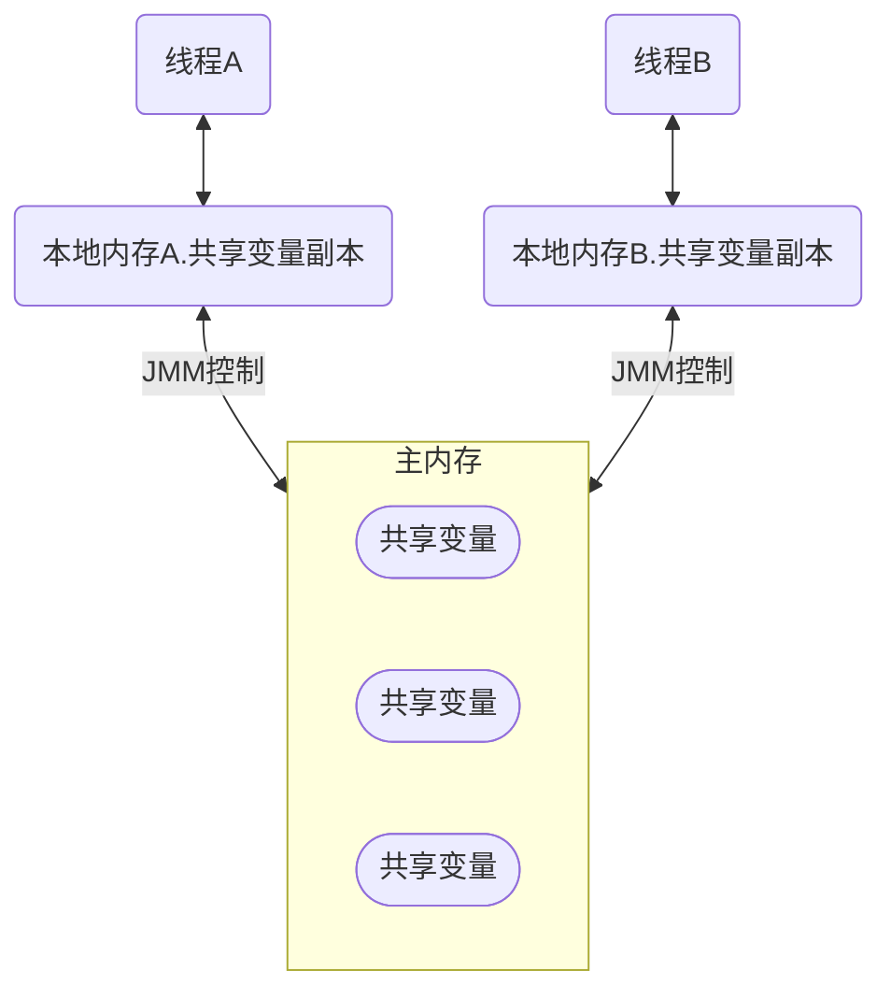
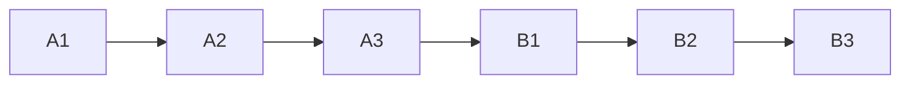
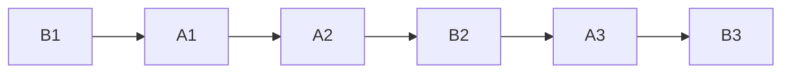

# 并发编程原理

## Java内存模型

- 线程间如何通信？即：线程之间以何种机制来交换信息
- 线程间如何同步？即：线程以何种机制来控制不同线程间操作发生的相对顺序

有两种并发模型可以解决这两个问题：

- 消息传递并发模型
- 共享内存并发模型

**在Java中，使用的是共享内存并发模型**。那么上面两个问题：

线程之间共享程序的公共状态，通过写-读内存中的公共状态进行隐式通信。

必须显式指定某段代码需要在线程之间互斥执行，同步是显式的。

### Java内存模型的抽象结构

#### 运行时内存的划分


对于每一个线程来说，栈都是私有的，而堆是共有的。

也就是说在栈中的变量（局部变量、方法定义参数、异常处理器参数）不会在线程之间共享，也就不会有内存可见性（下文会说到）的问题，也不受内存模型的影响。而在堆中的变量是共享的，本文称为共享变量。

所以，内存可见性是针对的**共享变量**。

#### 既然堆是共享的，为什么在堆中会有内存不可见问题

**缓存，它加了缓存**

这是因为现代计算机为了高效，往往会在高速缓存区中缓存共享变量，因为cpu访问缓存区比访问内存要快得多。

> 线程之间的共享变量存在主内存中，每个线程都有一个私有的本地内存，存储了该线程以读、写共享变量的副本。本地内存是Java内存模型的一个抽象概念，并不真实存在。它涵盖了缓存、写缓冲区、寄存器等。

Java线程之间的通信由Java内存模型（简称JMM）控制，从抽象的角度来说，JMM定义了线程和主内存之间的抽象关系。JMM的抽象示意图如图所示：



从图中可以看出：

1. 所有的共享变量都存在主内存中。
2. 每个线程都保存了一份该线程使用到的共享变量的副本。
3. 如果线程A与线程B之间要通信的话，必须经历下面2个步骤：
   1. 线程A将本地内存A中更新过的共享变量刷新到主内存中去。
   2. 线程B到主内存中去读取线程A之前已经更新过的共享变量。

**所以，线程A无法直接访问线程B的工作内存，线程间通信必须经过主内存。**

注意，根据JMM的规定，**线程对共享变量的所有操作都必须在自己的本地内存中进行，不能直接从主内存中读取**。

所以线程B并不是直接去主内存中读取共享变量的值，而是先在本地内存B中找到这个共享变量，发现这个共享变量已经被更新了，然后本地内存B去主内存中读取这个共享变量的新值，并拷贝到本地内存B中，最后线程B再读取本地内存B中的新值。

那么怎么知道这个共享变量的被其他线程更新了呢？这就是JMM的功劳了，也是JMM存在的必要性之一。**JMM通过控制主内存与每个线程的本地内存之间的交互，来提供内存可见性保证**。

* Java中的**volatile**关键字可以保证多线程操作共享变量的可见性以及禁止指令重排序
* **synchronized**关键字不仅保证可见性，同时也保证了原子性（互斥性）
* 在更底层，JMM通过内存屏障来实现内存的可见性以及禁止重排序。为了程序员的方便理解，提出了**happens-before**，它更加的简单易懂，从而避免了程序员为了理解内存可见性而去学习复杂的重排序规则以及这些规则的具体实现方法。

#### JMM与Java内存区域划分的区别与联系

- 区别

  两者是不同的概念层次。**JMM是抽象的**，他是用来描述一组规则，通过这个规则来控制各个变量的访问方式，围绕原子性、有序性、可见性等展开的。而**Java运行时内存的划分是具体的**，是JVM运行Java程序时，必要的内存划分。

- 联系

  都存在私有数据区域和共享数据区域。一般来说，JMM中的主内存属于共享数据区域，他是包含了堆和方法区；同样，JMM中的本地内存属于私有数据区域，包含了程序计数器、本地方法栈、虚拟机栈。

## 重排序和happens-before

上节说到JMM模型使用volatile、synchronized和happens-before等方式控制主存和各个本地内存之间的交互。这节讨论下happens-before是个啥。

### 什么是重排序

计算机在执行程序时，为了提高性能，编译器和处理器常常会对指令做重排。

**为什么指令重排可以提高计算机的执行效率？**

我们分析一下下面这个代码的执行情况：

```c
a = b + c;
d = e - f ;
```

先加载b、c（**注意，即有可能先加载b，也有可能先加载c**），但是在执行add(b,c)的时候，需要等待b、c装载结束才能继续执行，也就是增加了停顿，那么后面的指令也会依次有停顿,这降低了计算机的执行效率。

为了减少这个停顿，我们可以先加载e和f,然后再去加载add(b,c),这样做对程序（串行）是没有影响的,但却减少了停顿。既然add(b,c)需要停顿，那还不如去做一些有意义的事情。
综上所述，**指令重排对于提高CPU处理性能十分必要。虽然由此带来了乱序的问题，但是这点牺牲是值得的。**

指令重排一般分为以下三种：

- **编译器优化重排**:编译器在**不改变单线程程序语义**的前提下，可以重新安排语句的执行顺序。
- **指令并行重排**:现代处理器采用了指令级并行技术来将多条指令重叠执行。如果**不存在数据依赖性**(即后一个执行的语句无需依赖前面执行的语句的结果)，处理器可以改变语句对应的机器指令的执行顺序。
- **内存系统重排**:由于处理器使用缓存和读写缓存冲区，这使得加载(load)和存储(store)操作看上去可能是在乱序执行，因为三级缓存的存在，导致内存与缓存的数据同步存在时间差。

**指令重排可以保证串行语义一致，但是没有义务保证多线程间的语义也一致**。所以在多线程下，指令重排序可能会导致一些问题。

### 顺序一致性模型与JMM的保证

顺序一致性内存模型是一个**理想化的理论参考模型**，它为程序员提供了极强的内存可见性保证。

#### 顺序一致性模型

顺序一致性模型有两大特性：

- 一个线程中的所有操作必须按照程序的顺序（即Java代码的顺序）来执行。
- 不管程序是否同步，所有线程都只能看到一个单一的操作执行顺序。即在顺序一致性模型中，每个操作必须是**原子性的，且立刻对所有线程可见**。

假设有两个线程A和B并发执行，线程A有3个操作，他们在程序中的顺序是A1->A2->A3，线程B也有3个操作，B1->B2->B3。

假设**正确使用了同步**，A线程的3个操作执行后释放锁，B线程获取同一个锁。那么在**顺序一致性模型**中的执行效果如下所示：



操作的执行整体上有序，并且两个线程都只能看到这个执行顺序。

假设**没有使用同步**，那么在**顺序一致性模型**中的执行效果如下所示：



操作的执行整体上无序，但是两个线程都只能看到这个执行顺序。之所以可以得到这个保证，是因为顺序一致性模型中的**每个操作必须立即对任意线程可见**。

操作的执行整体上无序，但是两个线程都只能看到这个执行顺序。之所以可以得到这个保证，是因为顺序一致性模型中的**每个操作必须立即对任意线程可见**

**但是JMM没有这样的保证。**

比如，在当前线程把写过的数据缓存在本地内存中，在没有刷新到主内存之前，这个写操作仅对当前线程可见；从其他线程的角度来观察，这个写操作根本没有被当前线程所执行。只有当前线程把本地内存中写过的数据刷新到主内存之后，这个写操作才对其他线程可见。在这种情况下，当前线程和其他线程看到的执行顺序是不一样的。

#### JMM中同步程序的顺序一致性效果

在顺序一致性模型中，所有操作完全按照程序的顺序串行执行。但是JMM中，临界区内（同步块或同步方法中）的代码可以发生重排序（但不允许临界区内的代码“逃逸”到临界区之外，因为会破坏锁的内存语义）。

同时，JMM会在退出临界区和进入临界区做特殊的处理，使得在临界区内程序获得与顺序一致性模型相同的内存视图。

**由此可见，JMM的具体实现方针是：在不改变（正确同步的）程序执行结果的前提下，尽量为编译期和处理器的优化打开方便之门**。

#### JMM中非同步程序的顺序一致性效果

对于未同步的多线程程序，JMM只提供**最小安全性**：线程读取到的值，要么是之前某个线程写入的值，要么是默认值，不会无中生有。

为了实现这个安全性，JVM在堆上分配对象时，首先会对内存空间清零，然后才会在上面分配对象（这两个操作是同步的）。

**JMM没有保证未同步程序的执行结果与该程序在顺序一致性中执行结果一致。因为如果要保证执行结果一致，那么JMM需要禁止大量的优化，对程序的执行性能会产生很大的影响。**

未同步程序在JMM和顺序一致性内存模型中的执行特性有如下差异：

1. 顺序一致性保证单线程内的操作会按程序的顺序执行；JMM不保证单线程内的操作会按程序的顺序执行。（因为重排序，但是JMM保证单线程下的重排序不影响执行结果）
2. 顺序一致性模型保证所有线程只能看到一致的操作执行顺序，而JMM不保证所有线程能看到一致的操作执行顺序。（因为JMM不保证所有操作立即可见）
3. 顺序一致性模型保证对所有的内存读写操作都具有原子性，而JMM不保证对64位的long型和double型变量的写操作具有原子性。

### happens-before(先行先发生)

#### 什么是happens-before

一方面，程序员需要JMM提供一个强的内存模型来编写代码；另一方面，编译器和处理器希望JMM对它们的束缚越少越好，这样它们就可以最可能多的做优化来提高性能，希望的是一个弱的内存模型。

JMM考虑了这两种需求，并且找到了平衡点，对编译器和处理器来说，**只要不改变程序的执行结果（单线程程序和正确同步了的多线程程序），编译器和处理器怎么优化都行。**

而对于程序员，JMM提供了**happens-before规则**（JSR-133规范），满足了程序员的需求——**简单易懂，并且提供了足够强的内存可见性保证。**换言之，程序员只要遵循happens-before规则，那他写的程序就能保证在JMM中具有强的内存可见性。


## volatile


## synchronized与锁


## CAS和原子操作


## AQS


- [ ] 阻塞队列原理
- [ ] synchronized原理
