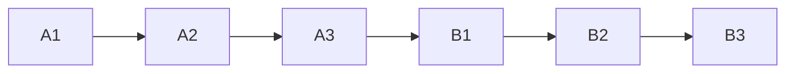
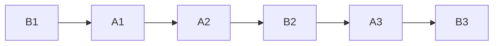

# 并发编程原理

[toc]

## Java内存模型

- 线程间如何通信？即：线程之间以何种机制来交换信息
- 线程间如何同步？即：线程以何种机制来控制不同线程间操作发生的相对顺序

有两种并发模型可以解决这两个问题：

- 消息传递并发模型
- 共享内存并发模型

**在Java中，使用的是共享内存并发模型**。那么上面两个问题：

线程之间共享程序的公共状态，通过写-读内存中的公共状态进行隐式通信。

必须显式指定某段代码需要在线程之间互斥执行，同步是显式的。

### Java内存模型的抽象结构

#### 运行时内存的划分


对于每一个线程来说，栈都是私有的，而堆是共有的。

也就是说在栈中的变量（局部变量、方法定义参数、异常处理器参数）不会在线程之间共享，也就不会有内存可见性（下文会说到）的问题，也不受内存模型的影响。而在堆中的变量是共享的，本文称为共享变量。

所以，内存可见性是针对的**共享变量**。

#### 既然堆是共享的，为什么在堆中会有内存不可见问题

**缓存，它加了缓存**

这是因为现代计算机为了高效，往往会在高速缓存区中缓存共享变量，因为cpu访问缓存区比访问内存要快得多。

> 线程之间的共享变量存在主内存中，每个线程都有一个私有的本地内存，存储了该线程以读、写共享变量的副本。本地内存是Java内存模型的一个抽象概念，并不真实存在。它涵盖了缓存、写缓冲区、寄存器等。

Java线程之间的通信由Java内存模型（简称JMM）控制，从抽象的角度来说，JMM定义了线程和主内存之间的抽象关系。JMM的抽象示意图如图所示：


从图中可以看出：

1. 所有的共享变量都存在主内存中。
2. 每个线程都保存了一份该线程使用到的共享变量的副本。
3. 如果线程A与线程B之间要通信的话，必须经历下面2个步骤：
   1. 线程A将本地内存A中更新过的共享变量刷新到主内存中去。
   2. 线程B到主内存中去读取线程A之前已经更新过的共享变量。

**所以，线程A无法直接访问线程B的工作内存，线程间通信必须经过主内存。**

注意，根据JMM的规定，**线程对共享变量的所有操作都必须在自己的本地内存中进行，不能直接从主内存中读取**。

所以线程B并不是直接去主内存中读取共享变量的值，而是先在本地内存B中找到这个共享变量，发现这个共享变量已经被更新了，然后本地内存B去主内存中读取这个共享变量的新值，并拷贝到本地内存B中，最后线程B再读取本地内存B中的新值。

那么怎么知道这个共享变量的被其他线程更新了呢？这就是JMM的功劳了，也是JMM存在的必要性之一。**JMM通过控制主内存与每个线程的本地内存之间的交互，来提供内存可见性保证**。

* Java中的**volatile**关键字可以保证多线程操作共享变量的可见性以及禁止指令重排序
* **synchronized**关键字不仅保证可见性，同时也保证了原子性（互斥性）
* 在更底层，JMM通过内存屏障来实现内存的可见性以及禁止重排序。为了程序员的方便理解，提出了**happens-before**，它更加的简单易懂，从而避免了程序员为了理解内存可见性而去学习复杂的重排序规则以及这些规则的具体实现方法。

#### JMM与Java内存区域划分的区别与联系

- 区别

  两者是不同的概念层次。**JMM是抽象的**，他是用来描述一组规则，通过这个规则来控制各个变量的访问方式，围绕原子性、有序性、可见性等展开的。而**Java运行时内存的划分是具体的**，是JVM运行Java程序时，必要的内存划分。

- 联系

  都存在私有数据区域和共享数据区域。一般来说，JMM中的主内存属于共享数据区域，他是包含了堆和方法区；同样，JMM中的本地内存属于私有数据区域，包含了程序计数器、本地方法栈、虚拟机栈。

## 重排序和happens-before

上节说到JMM模型使用volatile、synchronized和happens-before等方式控制主存和各个本地内存之间的交互。这节讨论下happens-before是个啥。

### 什么是重排序

计算机在执行程序时，为了提高性能，编译器和处理器常常会对指令做重排。

**为什么指令重排可以提高计算机的执行效率？**

我们分析一下下面这个代码的执行情况：

```c
a = b + c;
d = e - f ;
```

先加载b、c（**注意，即有可能先加载b，也有可能先加载c**），但是在执行add(b,c)的时候，需要等待b、c装载结束才能继续执行，也就是增加了停顿，那么后面的指令也会依次有停顿,这降低了计算机的执行效率。

为了减少这个停顿，我们可以先加载e和f,然后再去加载add(b,c),这样做对程序（串行）是没有影响的,但却减少了停顿。既然add(b,c)需要停顿，那还不如去做一些有意义的事情。
综上所述，**指令重排对于提高CPU处理性能十分必要。虽然由此带来了乱序的问题，但是这点牺牲是值得的。**

指令重排一般分为以下三种：

- **编译器优化重排**:编译器在**不改变单线程程序语义**的前提下，可以重新安排语句的执行顺序。
- **指令并行重排**:现代处理器采用了指令级并行技术来将多条指令重叠执行。如果**不存在数据依赖性**(即后一个执行的语句无需依赖前面执行的语句的结果)，处理器可以改变语句对应的机器指令的执行顺序。
- **内存系统重排**:由于处理器使用缓存和读写缓存冲区，这使得加载(load)和存储(store)操作看上去可能是在乱序执行，因为三级缓存的存在，导致内存与缓存的数据同步存在时间差。

**指令重排可以保证串行语义一致，但是没有义务保证多线程间的语义也一致**。所以在多线程下，指令重排序可能会导致一些问题。

### 顺序一致性模型与JMM的保证

顺序一致性内存模型是一个**理想化的理论参考模型**，它为程序员提供了极强的内存可见性保证。

#### 顺序一致性模型

顺序一致性模型有两大特性：

- 一个线程中的所有操作必须按照程序的顺序（即Java代码的顺序）来执行。
- 不管程序是否同步，所有线程都只能看到一个单一的操作执行顺序。即在顺序一致性模型中，每个操作必须是**原子性的，且立刻对所有线程可见**。

假设有两个线程A和B并发执行，线程A有3个操作，他们在程序中的顺序是A1->A2->A3，线程B也有3个操作，B1->B2->B3。

假设**正确使用了同步**，A线程的3个操作执行后释放锁，B线程获取同一个锁。那么在**顺序一致性模型**中的执行效果如下所示：



操作的执行整体上有序，并且两个线程都只能看到这个执行顺序。

假设**没有使用同步**，那么在**顺序一致性模型**中的执行效果如下所示：



操作的执行整体上无序，但是两个线程都只能看到这个执行顺序。之所以可以得到这个保证，是因为顺序一致性模型中的**每个操作必须立即对任意线程可见**。

操作的执行整体上无序，但是两个线程都只能看到这个执行顺序。之所以可以得到这个保证，是因为顺序一致性模型中的**每个操作必须立即对任意线程可见**

**但是JMM没有这样的保证。**

比如，在当前线程把写过的数据缓存在本地内存中，在没有刷新到主内存之前，这个写操作仅对当前线程可见；从其他线程的角度来观察，这个写操作根本没有被当前线程所执行。只有当前线程把本地内存中写过的数据刷新到主内存之后，这个写操作才对其他线程可见。在这种情况下，当前线程和其他线程看到的执行顺序是不一样的。

#### JMM中同步程序的顺序一致性效果

在顺序一致性模型中，所有操作完全按照程序的顺序串行执行。但是JMM中，临界区内（同步块或同步方法中）的代码可以发生重排序（但不允许临界区内的代码“逃逸”到临界区之外，因为会破坏锁的内存语义）。

同时，JMM会在退出临界区和进入临界区做特殊的处理，使得在临界区内程序获得与顺序一致性模型相同的内存视图。

**由此可见，JMM的具体实现方针是：在不改变（正确同步的）程序执行结果的前提下，尽量为编译期和处理器的优化打开方便之门**。

#### JMM中非同步程序的顺序一致性效果

对于未同步的多线程程序，JMM只提供**最小安全性**：线程读取到的值，要么是之前某个线程写入的值，要么是默认值，不会无中生有。

为了实现这个安全性，JVM在堆上分配对象时，首先会对内存空间清零，然后才会在上面分配对象（这两个操作是同步的）。

**JMM没有保证未同步程序的执行结果与该程序在顺序一致性中执行结果一致。因为如果要保证执行结果一致，那么JMM需要禁止大量的优化，对程序的执行性能会产生很大的影响。**

未同步程序在JMM和顺序一致性内存模型中的执行特性有如下差异：

1. 顺序一致性保证单线程内的操作会按程序的顺序执行；JMM不保证单线程内的操作会按程序的顺序执行。（因为重排序，但是JMM保证单线程下的重排序不影响执行结果）
2. 顺序一致性模型保证所有线程只能看到一致的操作执行顺序，而JMM不保证所有线程能看到一致的操作执行顺序。（因为JMM不保证所有操作立即可见）
3. 顺序一致性模型保证对所有的内存读写操作都具有原子性，而JMM不保证对64位的long型和double型变量的写操作具有原子性。

### happens-before(先行先发生)

#### 什么是happens-before

一方面，程序员需要JMM提供一个强的内存模型来编写代码；另一方面，编译器和处理器希望JMM对它们的束缚越少越好，这样它们就可以最可能多的做优化来提高性能，希望的是一个弱的内存模型。

JMM考虑了这两种需求，并且找到了平衡点，对编译器和处理器来说，**只要不改变程序的执行结果（单线程程序和正确同步了的多线程程序），编译器和处理器怎么优化都行。**

而对于程序员，JMM提供了**happens-before规则**（JSR-133规范），满足了程序员的需求——**简单易懂，并且提供了足够强的内存可见性保证。**换言之，**程序员只要遵循happens-before规则，那他写的程序就能保证在JMM中具有强的内存可见性。**

JMM使用happens-before的概念来定制两个操作之间的执行顺序。这两个操作可以在一个线程以内，也可以是不同的线程之间。因此，JMM可以通过happens-before关系向程序员提供跨线程的内存可见性保证。

happens-before关系的定义如下：

1. 如果一个操作happens-before另一个操作，那么第一个操作的执行结果将对第二个操作可见，而且第一个操作的执行顺序排在第二个操作之前。
2. **两个操作之间存在happens-before关系，并不意味着Java平台的具体实现必须要按照happens-before关系指定的顺序来执行。如果重排序之后的执行结果，与按happens-before关系来执行的结果一致，那么JMM也允许这样的重排序。**

总之，**如果操作A happens-before操作B，那么操作A在内存上所做的操作对操作B都是可见的，不管它们在不在一个线程。**

在Java中存在一些**天然的先行先发生：**

* **程序顺序规则**：一个线程中的每一个操作，happens-before于该线程中的任意后续操作。
* **监视器锁规则**：对一个锁的解锁，happens-before于随后对这个锁的加锁。
* **volatile变量规则**：对一个volatile域的写，happens-before于任意后续对这个volatile域的读。
* **传递性**：如果A happens-before B，且B happens-before C，那么A happens-before C。
* **start规则**：如果线程A执行操作ThreadB.start()启动线程B，那么A线程的ThreadB.start（）操作happens-before于线程B中的任意操作。
* **join规则**：如果线程A执行操作ThreadB.join（）并成功返回，那么线程B中的任意操作happens-before于线程A从ThreadB.join()操作成功返回。

```java
int a = 1; // A操作
int b = 2; // B操作
int sum = a + b;// C 操作
System.out.println(sum);
```

根据以上介绍的happens-before规则，假如只有一个线程，那么不难得出：

```java
1> A happens-before B 
2> B happens-before C 
3> A happens-before C
```

注意，真正在执行指令的时候，**其实JVM有可能对操作A & B进行重排序**，因为无论先执行A还是B，他们都对对方是可见的，并且不影响执行结果。

如果这里发生了重排序，这在视觉上违背了happens-before原则，但是JMM是允许这样的重排序的。

所以，我们只关心happens-before规则，不用关心JVM到底是怎样执行的。只要确定操作A happens-before操作B就行了。看起来结果像那么回事就成，愚蠢的人类不需要知道执行细节顺序。

重排序有两类，JMM对这两类重排序有不同的策略：

* 会改变程序执行结果的重排序，比如 A -> C，JMM要求编译器和处理器都禁止这种重排序。
* 不会改变程序执行结果的重排序，比如 A -> B，JMM对编译器和处理器不做要求，允许这种重排序。

## volatile

### 名词解释

* 内存可见性：**指的是线程之间的可见性，当一个线程修改了共享变量时，另一个线程可以读取到这个修改后的值**。
* 重排序：为优化程序性能，对原有的指令执行顺序进行优化重新排序。重排序可能发生在多个阶段，比如编译重排序、CPU重排序等。
* happens-before规则：是一个给程序员使用的规则，只要程序员在写代码的时候遵循happens-before规则，JVM就能保证指令在多线程之间的顺序性符合程序员的预期。

### volatile内存语义

在Java中，volatile关键字有特殊的内存语义。volatile主要有以下两个功能：

* 保证变量的**内存可见性**

* 禁止volatile变量与普通变量**重排序**（JSR133提出，Java 5 开始才有这个“增强的volatile内存语义”）

  > 编译器在**生成字节码时**，会在指令序列中插入内存屏障来禁止特定类型的处理器重排序。编译器选择了一个**比较保守的JMM内存屏障插入策略**，这样可以保证在任何处理器平台，任何程序中都能得到正确的volatile内存语义。

#### 内存可见性

```java
public class VolatileExample {
    int a = 0;
    volatile boolean flag = false;

    public void writer() {
        a = 1; // step 1
        flag = true; // step 2
    }

    public void reader() {
        if (flag) { // step 3
            System.out.println(a); // step 4
        }
    }
}
```

在这段代码里，我们使用`volatile`关键字修饰了一个`boolean`类型的变量`flag`。

所谓内存可见性，指的是当一个线程对`volatile`修饰的变量进行**写操作**（比如step 2）时，JMM会立即把该线程对应的本地内存中的共享变量的值刷新到主内存；当一个线程对`volatile`修饰的变量进行**读操作**（比如step 3）时，JMM会把立即该线程对应的本地内存置为无效，从主内存中读取共享变量的值。

假设在时间线上，线程A先执行方法`writer`方法，线程B后执行`reader`方法。线程B本地内存中的值会更新成`a = 0, flag = true`

而如果`flag`变量**没有**用`volatile`修饰，在step 2，线程A的本地内存里面的变量就不会立即更新到主内存，那随后线程B也同样不会去主内存拿最新的值，仍然使用线程B本地内存缓存的变量的值`a = 0，flag = false`。

**那考虑这种情况，如果两个线程同时写入被volatile修饰的变量会怎么样？值会正确更新吗？**


图中两个线程读到的值一开始时相同的，但写入的时候其他线程可能先写入了。 对于这种只能通过synchronizd关键字处理了。 只要多个线程涉及了读和写，[volatile is Not Always Enough](http://tutorials.jenkov.com/java-concurrency/volatile.html).一个写，多个读是没有问题的。

同时思考下面的代码，结果会符合预期吗？

```java
public static class TestData {
    volatile int num = 0;
    //synchronized
    public void updateNum(){
        num++;  // idea也会提示非原子操作的警告
    }
    public static void main(String[] args) {
        final TestData testData = new TestData();
        for(int i = 1; i <= 10; i++) {
            new Thread(new Runnable() {
                @Override
                public void run() {
                    for (int j = 1; j <= 1000; j++) {
                        testData.updateNum();
                    }
                }
            }).start();
        }

        while (Thread.activeCount() > 2) {
            Thread.yield();
        }
        System.out.println("最终结果：" + testData.num);
    }
}
```

答案是不会，大概率会小于期望值。

#### 禁止重排序（volatile变量和普通变量）

在JSR-133之前的旧的Java内存模型中，是允许volatile变量与普通变量重排序的。

那上面的案例中，可能就会被重排序成下列时序来执行：

1. 线程A写volatile变量，step 2，设置flag为true；
2. 线程B读同一个volatile，step 3，读取到flag为true；
3. 线程B读普通变量，step 4，读取到 a = 0；
4. 线程A修改普通变量，step 1，设置 a = 1；

可见，如果**volatile变量**与**普通变量**发生了重排序，虽然volatile变量能保证内存可见性，也可能导致**普通变量读取错误。**

为了提供一种比锁更轻量级的**线程间的通信机制**，**JSR-133**专家组决定增强volatile的内存语义：严格限制编译器和处理器对volatile变量与普通变量的重排序。编译器还好说，JVM是怎么还能限制处理器的重排序的呢？它是通过**内存屏障**来实现的。

什么是内存屏障？硬件层面，内存屏障分两种：读屏障（Load Barrier）和写屏障（Store Barrier）。内存屏障有两个作用：

1. 阻止屏障两侧的指令重排序；
2. 强制把写缓冲区/高速缓存中的脏数据等写回主内存，或者让缓存中相应的数据失效。

编译器在**生成字节码时**，会在指令序列中插入内存屏障来禁止特定类型的处理器重排序。编译器选择了一个**比较保守的JMM内存屏障插入策略**，这样可以保证在任何处理器平台，任何程序中都能得到正确的volatile内存语义。这个策略是：

* 在每个volatile写操作前插入一个StoreStore屏障；
* 在每个volatile写操作后插入一个StoreLoad屏障；
* 在每个volatile读操作后插入一个LoadLoad屏障；
* 在每个volatile读操作后再插入一个LoadStore屏障。


再介绍一下volatile与普通变量的重排序规则:

1. 如果第一个操作是volatile读，那无论第二个操作是什么，都不能重排序；
2. 如果第二个操作是volatile写，那无论第一个操作是什么，都不能重排序；
3. 如果第一个操作是volatile写，第二个操作是volatile读，那不能重排序。

### 用途

从volatile的内存语义上来看，volatile可以保证内存可见性且禁止重排序。

在保证内存可见性这一点上，volatile有着与锁相同的内存语义，所以可以作为一个“轻量级”的锁来使用。但由于volatile仅仅保证对单个volatile变量的读/写具有原子性，而锁可以保证整个**临界区代码**的执行具有原子性。所以**在功能上，锁比volatile更强大；在性能上，volatile更有优势**。

**DCL单例**

```java
public class Singleton {

  // 不使用volatile关键字  
  private static Singleton instance; 

    // 双重锁检验
    public static Singleton getInstance() {
        if (instance == null) { // 第7行
            synchronized (Singleton.class) {
                if (instance == null) {
                    instance = new Singleton(); // 第10行
                }
            }
        }
        return instance;
    }
}
```

如果这里的变量声明不使用volatile关键字，是可能会发生错误的。它可能会被重排序：

```java
instance = new Singleton(); // 第10行

// 可以分解为以下三个步骤
1 memory=allocate();// 分配内存 相当于c的malloc
2 ctorInstanc(memory) //初始化对象
3 s=memory //设置s指向刚分配的地址

// 上述三个步骤可能会被重排序为 1-3-2，也就是：
1 memory=allocate();// 分配内存 相当于c的malloc
3 s=memory //设置s指向刚分配的地址
2 ctorInstanc(memory) //初始化对象
```

## synchronized与锁

**Java多线程的锁都是基于对象的**，Java中的每一个对象都可以作为一个锁。从源码中可以发现顶层类`Object`中存在锁相关方法。


### 用法

它通常有以下三种形式：

1. 关键字在实例方法上，锁为当前实例

   ```java
   public synchronized void instanceLock() {
       // code
   }
   ```

2. 关键字在静态方法上，锁为当前Class对象

   ```java
   public static synchronized void classLock() {
       // code
   }
   ```

3. 关键字在代码块上，锁为括号里面的对象

   ```java
   public void blockLock() {
       Object o = new Object();
       synchronized (o) {
           // code
       }
   }
   ```

> 所谓“临界区”，指的是某一块代码区域，它同一时刻只能由一个线程执行。

如果`synchronized`关键字在方法上，那临界区就是整个方法内部。而如果是使用synchronized代码块，那临界区就指的是代码块内部的区域。

### 原理

对于如下代码：

```java
public class SyncTest {
    public void syncBlock(){
        synchronized (this){
            System.out.println("hello block");
        }
    }
    public synchronized void syncMethod(){
        System.out.println("hello method");
    }
}
```

当SyncTest.java被编译成class文件的时候，`synchronized`关键字和`synchronized`方法的字节码略有不同，我们可以用`javap -v` 命令查看class文件对应的JVM字节码信息，部分信息如下：

```java
{
  public void syncBlock();
    descriptor: ()V
    flags: ACC_PUBLIC
    Code:
      stack=2, locals=3, args_size=1
         0: aload_0
         1: dup
         2: astore_1
         3: monitorenter				 	  // monitorenter指令进入同步块
         4: getstatic     #2                  // Field java/lang/System.out:Ljava/io/PrintStream;
         7: ldc           #3                  // String hello block
         9: invokevirtual #4                  // Method java/io/PrintStream.println:(Ljava/lang/String;)V
        12: aload_1
        13: monitorexit						  // monitorexit指令退出同步块
        14: goto          22
        17: astore_2
        18: aload_1
        19: monitorexit						  // monitorexit指令退出同步块
        20: aload_2
        21: athrow
        22: return
      Exception table:
         from    to  target type
             4    14    17   any
            17    20    17   any
 
  public synchronized void syncMethod();
    descriptor: ()V
    flags: ACC_PUBLIC, ACC_SYNCHRONIZED      //添加了ACC_SYNCHRONIZED标记
    Code:
      stack=2, locals=1, args_size=1
         0: getstatic     #2                  // Field java/lang/System.out:Ljava/io/PrintStream;
         3: ldc           #5                  // String hello method
         5: invokevirtual #4                  // Method java/io/PrintStream.println:(Ljava/lang/String;)V
         8: return
 
}
```

从上面的中文注释处可以看到，对于`synchronized`关键字而言，`javac`在编译时，会生成对应的`monitorenter`和`monitorexit`指令分别对应`synchronized`同步块的进入和退出，有两个`monitorexit`指令的原因是：为了保证抛异常的情况下也能释放锁，所以`javac`为同步代码块添加了一个隐式的try-finally，在finally中会调用`monitorexit`命令释放锁。而对于`synchronized`方法而言，`javac`为其生成了一个`ACC_SYNCHRONIZED`关键字，在JVM进行方法调用时，发现调用的方法被`ACC_SYNCHRONIZED`修饰，则会先尝试获得锁。

在JDK 1.6之前,`synchronized`只有传统的锁机制，因此给开发者留下了`synchronized`关键字相比于其他同步机制性能不好的印象。

在JDK 1.6引入了两种新型锁机制：偏向锁和轻量级锁，它们的引入是为了解决在没有多线程竞争或基本没有竞争的场景下因使用传统锁机制带来的性能开销问题。

### 锁类型

所以在Java 6 及其以后，一个对象其实有四种锁状态，它们级别由低到高依次是：

1. 无锁状态
2. 偏向锁状态
3. 轻量级锁状态
4. 重量级锁状态

几种锁会随着竞争情况逐渐升级，锁的升级很容易发生，**但是锁降级发生的条件会比较苛刻，锁降级发生在Stop The World期间，当JVM进入安全点的时候，会检查是否有闲置的锁，然后进行降级。**

#### 偏向锁

Hotspot的作者经过以往的研究发现大多数情况下**锁不仅不存在多线程竞争，而且总是由同一线程多次获得**，于是引入了偏向锁。

偏向锁会偏向于第一个访问锁的线程，如果在接下来的运行过程中，该锁没有被其他的线程访问，则持有偏向锁的线程将永远不需要触发同步。也就是说，**偏向锁在资源无竞争情况下消除了同步语句，连CAS操作都不做了，提高了程序的运行性能。**

##### 偏向锁撤销

偏向锁使用了一种**等到竞争出现才释放锁的机制**，所以当其他线程尝试竞争偏向锁时， 持有偏向锁的线程才会释放锁。

偏向锁升级成轻量级锁时，会暂停拥有偏向锁的线程，重置偏向锁标识，这个过程看起来容易，实则开销还是很大的，大概的过程如下：

1. 在一个安全点（在这个时间点上没有字节码正在执行）停止拥有锁的线程。
2. 遍历线程栈，如果存在锁记录的话，需要修复锁记录和Mark Word，使其变成无锁状态。
3. 唤醒被停止的线程，将当前锁升级成轻量级锁。

所以，如果应用程序里所有的**锁通常处于竞争状态，那么偏向锁就会是一种累赘**，对于这种情况，我们可以一开始就把偏向锁这个默认功能给关闭：

```bash
-XX:UseBiasedLocking=false。
```

#### 轻量级锁

多个线程在不同时段获取同一把锁，即不存在锁竞争的情况，也就没有线程阻塞。针对这种情况，JVM采用轻量级锁来避免线程的阻塞与唤醒。

##### 加锁

JVM会为每个线程在当前线程的栈帧中创建用于存储锁记录的空间，我们称为Displaced Mark Word。如果一个线程获得锁的时候发现是轻量级锁，会把**锁的Mark Word复制到自己的Displaced Mark Word里面**（后面释放锁恢复用）。

然后线程尝试用CAS将锁的Mark Word替换为指向锁记录的指针。如果成功，当前线程获得锁，如果失败，表示Mark Word已经被替换成了其他线程的锁记录，说明在与其它线程竞争锁，当前线程就尝试使用自旋来获取锁。

自旋是需要消耗CPU的，如果一直获取不到锁的话，那该线程就一直处在自旋状态，白白浪费CPU资源。解决这个问题最简单的办法就是指定自旋的次数，例如让其循环10次，如果还没获取到锁就进入阻塞状态。

**但是JDK采用了更聪明的方式——适应性自旋，简单来说就是线程如果自旋成功了，则下次自旋的次数会更多，如果自旋失败了，则自旋的次数就会减少。**

自旋也不是一直进行下去的，如果自旋到一定程度（和JVM、操作系统相关），依然没有获取到锁，称为自旋失败，那么这个线程会阻塞。同时这个锁就会**升级成重量级锁**。

##### 锁释放

在释放锁时，当前线程会使用CAS操作将Displaced Mark Word的内容复制回锁的Mark Word里面。如果没有发生竞争，那么这个复制的操作会成功。如果有其他线程因为自旋多次导致轻量级锁升级成了重量级锁，那么CAS操作会失败，此时会释放锁并唤醒被阻塞的线程。

#### 重量级锁

重量级锁依赖于操作系统的互斥量（mutex） 实现的，而操作系统中线程间状态的转换需要相对比较长的时间，所以重量级锁效率很低，但被阻塞的线程不会消耗CPU。

每一个对象都可以当做一个锁，当多个线程同时请求某个对象锁时，对象锁会设置几种状态用来区分请求的线程：

```tex
Contention List：所有请求锁的线程将被首先放置到该竞争队列
Entry List：Contention List中那些有资格成为候选人的线程被移到Entry List
Wait Set：那些调用wait方法被阻塞的线程被放置到Wait Set
OnDeck：任何时刻最多只能有一个线程正在竞争锁，该线程称为OnDeck
Owner：获得锁的线程称为Owner
!Owner：释放锁的线程
```

当一个线程尝试获得锁时，如果该锁已经被占用，则会将该线程封装成一个`ObjectWaiter`对象插入到Contention List的队列的队首，然后调用`park`函数挂起当前线程。

当线程释放锁时，会从Contention List或EntryList中挑选一个线程唤醒，被选中的线程叫做`Heir presumptive`即假定继承人，假定继承人被唤醒后会尝试获得锁，但`synchronized`是非公平的，所以假定继承人不一定能获得锁。这是因为对于重量级锁，线程先自旋尝试获得锁，这样做的目的是为了减少执行操作系统同步操作带来的开销。如果自旋不成功再进入等待队列。这对那些已经在等待队列中的线程来说，稍微显得不公平，还有一个不公平的地方是自旋线程可能会抢占了Ready线程的锁。

如果线程获得锁后调用`Object.wait`方法，则会将线程加入到WaitSet中，当被`Object.notify`唤醒后，会将线程从WaitSet移动到Contention List或EntryList中去。需要注意的是，当调用一个锁对象的`wait`或`notify`方法时，**如当前锁的状态是偏向锁或轻量级锁则会先膨胀成重量级锁**。

### 总结升级流程

每一个线程在准备获取共享资源时： 第一步，检查MarkWord里面是不是放的自己的ThreadId ,如果是，表示当前线程是处于 “偏向锁” 。

第二步，如果MarkWord不是自己的ThreadId，锁升级，这时候，用CAS来执行切换，新的线程根据MarkWord里面现有的ThreadId，通知之前线程暂停，之前线程将Markword的内容置为空。

第三步，两个线程都把锁对象的HashCode复制到自己新建的用于存储锁的记录空间，接着开始通过CAS操作， 把锁对象的MarKword的内容修改为自己新建的记录空间的地址的方式竞争MarkWord。

第四步，第三步中成功执行CAS的获得资源，失败的则进入自旋 。

第五步，自旋的线程在自旋过程中，成功获得资源(即之前获的资源的线程执行完成并释放了共享资源)，则整个状态依然处于 轻量级锁的状态，如果自旋失败 。

第六步，进入重量级锁的状态，这个时候，自旋的线程进行阻塞，等待之前线程执行完成并唤醒自己。

## CAS和原子操作

锁可以从不同的角度分类。其中，乐观锁和悲观锁是一种分类方式。

**悲观锁：**

悲观锁就是我们常说的锁。对于悲观锁来说，它总是认为每次访问共享资源时会发生冲突，所以必须对每次数据操作加上锁，以保证临界区的程序同一时间只能有一个线程在执行。

**乐观锁：**

乐观锁又称为“无锁”，顾名思义，它是乐观派。乐观锁总是假设对共享资源的访问没有冲突，线程可以不停地执行，无需加锁也无需等待。而一旦多个线程发生冲突，乐观锁通常是使用一种称为CAS的技术来保证线程执行的安全性。

由于无锁操作中没有锁的存在，因此不可能出现死锁的情况，也就是说**乐观锁天生免疫死锁**。

> 乐观锁有什么缺点吗?
>
> * 长时间自旋可能导致开销大。假如CAS长时间不成功而一直自旋，会给CPU带来很大的开销
> * ABA问题

乐观锁多用于“读多写少“的环境，避免频繁加锁影响性能；而悲观锁多用于”写多读少“的环境，避免频繁失败和重试影响性能。

### CAS概念(无锁算法)

CAS的全称是：比较并交换（Compare And Swap）。在CAS中，有这样三个值：

* V：要更新的变量(var)
* E：预期值(expected)
* N：新值(new)

比较并交换的过程如下：

判断V是否等于E，如果等于，将V的值设置为N；如果不等，说明已经有其它线程更新了V，则当前线程放弃更新，**什么都不做**。

### Java中实现CAS原理

在Java中，有一个`Unsafe`类，它在`sun.misc`包中。它里面是一些`native`方法，其中就有几个关于CAS的：

```java
    /**
     * Atomically update Java variable to <tt>x</tt> if it is currently
     * holding <tt>expected</tt>.
     * @return <tt>true</tt> if successful
     */
    public final native boolean compareAndSwapObject(Object o, long offset,
                                                     Object expected,
                                                     Object x);

    /**
     * Atomically update Java variable to <tt>x</tt> if it is currently
     * holding <tt>expected</tt>.
     * @return <tt>true</tt> if successful
     */
    public final native boolean compareAndSwapInt(Object o, long offset,
                                                  int expected,
                                                  int x);

    /**
     * Atomically update Java variable to <tt>x</tt> if it is currently
     * holding <tt>expected</tt>.
     * @return <tt>true</tt> if successful
     */
    public final native boolean compareAndSwapLong(Object o, long offset,
                                                   long expected,
                                                   long x);
```

Unsafe中对CAS的实现是C++写的，它的具体实现和操作系统、CPU都有关系。

Linux的X86下主要是通过`cmpxchgl`这个指令在CPU级完成CAS操作的，但在多处理器情况下必须使用`lock`指令加锁来完成。

### AtomicInteger

以`AtomicInteger`类的`getAndAdd(int delta)`方法为例，来看看Java是如何实现原子操作的。

先看看这个方法的源码：

```java
public final int getAndAdd(int delta) {
    return U.getAndAddInt(this, VALUE, delta);
}
```

所以其实`AtomicInteger`类的`getAndAdd(int delta)`方法是调用`Unsafe`类的方法来实现的：

```java
public final int getAndAddInt(Object o, long offset, int delta) {
    int v;
    do {
        v = getIntVolatile(o, offset);
    } while (!weakCompareAndSetInt(o, offset, v, v + delta));
    return v;
}
```

这里使用的是**do-while循环**。这种循环不多见，它的目的是**保证循环体内的语句至少会被执行一遍**。这样才能保证return 的值`v`是我们期望的值。

再回到循环条件上来，可以看到它是在不断尝试去用CAS更新。如果更新失败，就继续重试。那为什么要把获取“旧值”v的操作放到循环体内呢？其实这也很好理解。前面我们说了，CAS如果旧值V不等于预期值E，它就会更新失败。说明旧的值发生了变化。那我们当然需要返回的是被其他线程改变之后的旧值了，因此放在了do循环体内。

### CAS引入的问题

#### ABA

所谓ABA问题，就是一个值原来是A，变成了B，又变回了A。这个时候使用CAS是检查不出变化的，但实际上却被更新了两次。

ABA问题的解决思路是在变量前面追加上**版本号或者时间戳**。从JDK 1.5开始，JDK的atomic包里提供了一个类`AtomicStampedReference`类来解决ABA问题。

这个类的`compareAndSet`方法的作用是首先检查当前引用是否等于预期引用，并且检查当前标志是否等于预期标志，如果二者都相等，才使用CAS设置为新的值和标志。

```java
public boolean compareAndSet(V   expectedReference,
                             V   newReference,
                             int expectedStamp,
                             int newStamp) {
    Pair<V> current = pair;
    return
        expectedReference == current.reference &&
        expectedStamp == current.stamp &&
        ((newReference == current.reference &&
          newStamp == current.stamp) ||
         casPair(current, Pair.of(newReference, newStamp)));
}
```

#### 循环时间开销大

CAS多与自旋结合。如果自旋CAS长时间不成功，会占用大量的CPU资源。

解决思路是让JVM支持处理器提供的**pause指令**。

pause指令能让自旋失败时cpu睡眠一小段时间再继续自旋，从而使得读操作的频率低很多,为解决内存顺序冲突而导致的CPU流水线重排的代价也会小很多。

#### 只能保证一个共享变量的原子操作

1. 使用JDK 1.5开始就提供的`AtomicReference`类保证对象之间的原子性，把多个变量放到一个对象里面进行CAS操作；
2. 使用锁。锁内的临界区代码可以保证只有当前线程能操作。

## AQS

**AQS**是`AbstractQueuedSynchronizer`的简称，即`抽象队列同步器`，从字面意思上理解:

* 抽象：抽象类，只实现一些主要逻辑，有些方法由子类实现；
* 队列：使用先进先出（FIFO）队列存储数据；
* 同步：实现了同步的功能。

### ReentrantLock与AQS的关联

ReentrantLock支持公平锁和非公平锁，并且ReentrantLock的底层就是由AQS来实现的。非公平锁源码中的加锁流程如下：

```java
// 非公平锁
static final class NonfairSync extends Sync {
	...
	final void lock() {
		if (compareAndSetState(0, 1))
			setExclusiveOwnerThread(Thread.currentThread());
		else
			acquire(1);
		}
  ...
}
```

这块代码的含义为：

* 若通过CAS设置变量State（同步状态）成功，也就是获取锁成功，则将当前线程设置为独占线程。
* 若通过CAS设置变量State（同步状态）失败，也就是获取锁失败，则进入Acquire方法进行后续处理。

第一步很好理解，但第二步获取锁失败后，后续的处理策略是怎么样的呢？这块可能会有以下思考：

* 某个线程获取锁失败的后续流程是什么呢？有以下两种可能：
  * 将当前线程获锁结果设置为失败，获取锁流程结束。这种设计会极大降低系统的并发度，并不满足我们实际的需求。所以就需要下面这种流程，也就是AQS框架的处理流程。
  * **存在某种排队等候机制，线程继续等待，仍然保留获取锁的可能，获取锁流程仍在继续**。

### AQS框架

首先，我们通过下面的架构图来整体了解一下AQS框架：


1. 上图中有颜色的为Method，无颜色的为Attribution。
2. AQS框架共分为五层，自上而下由浅入深，从AQS对外暴露的API到底层基础数据。
3. 当有自定义同步器接入时，只需重写第一层所需要的部分方法即可，不需要关注底层具体的实现流程。当自定义同步器进行加锁或者解锁操作时，先经过第一层的API进入AQS内部方法，然后经过第二层进行锁的获取，接着对于获取锁失败的流程，进入第三层和第四层的等待队列处理，而这些处理方式均依赖于第五层的基础数据提供层。

### AQS原理

AQS核心思想是，如果被请求的共享资源空闲，那么就将当前请求资源的线程设置为有效的工作线程，将共享资源设置为锁定状态；如果共享资源被占用，就需要一定的阻塞等待唤醒机制来保证锁分配。这个机制主要用的是CLH队列的变体实现的，将暂时获取不到锁的线程加入到队列中。

CLH：Craig、Landin and Hagersten队列，是单向链表，AQS中的队列是CLH变体的虚拟双向队列（FIFO），AQS是通过将每条请求共享资源的线程封装成一个节点来实现锁的分配。


AQS使用一个Volatile的int类型的成员变量来表示同步状态，通过内置的FIFO队列来完成资源获取的排队工作，通过CAS完成对State值的修改。

#### 数据结构

AQS中最基本的数据结构——Node，Node即为上面CLH变体队列中的节点。

解释一下几个方法和属性值的含义：

| 方法和属性值 | 含义                                                         |
| :----------- | :----------------------------------------------------------- |
| waitStatus   | 当前节点在队列中的状态                                       |
| thread       | 表示处于该节点的线程                                         |
| prev         | 前驱指针                                                     |
| predecessor  | 返回前驱节点，没有的话抛出npe                                |
| nextWaiter   | 指向下一个处于CONDITION状态的节点（由于本篇文章不讲述Condition Queue队列，这个指针不多介绍） |
| next         | 后继指针                                                     |

线程两种锁的模式：

| 模式      | 含义                           |
| :-------- | :----------------------------- |
| SHARED    | 表示线程以共享的模式等待锁     |
| EXCLUSIVE | 表示线程正在以独占的方式等待锁 |

waitStatus有下面几个枚举值：

| 枚举      | 含义                                           |
| :-------- | :--------------------------------------------- |
| 0         | 当一个Node被初始化的时候的默认值               |
| CANCELLED | 为1，表示线程获取锁的请求已经取消了            |
| CONDITION | 为-2，表示节点在等待队列中，节点线程等待唤醒   |
| PROPAGATE | 为-3，当前线程处在SHARED情况下，该字段才会使用 |
| SIGNAL    | 为-1，表示线程已经准备好了，就等资源释放了     |

#### 同步状态State

AQS中维护了一个名为state的字段，意为同步状态，是由Volatile修饰的，用于展示当前临界资源的获锁情况。

提供了几个访问这个字段的方法：

| 方法名                                                       | 描述                 |
| :----------------------------------------------------------- | :------------------- |
| protected final int getState()                               | 获取State的值        |
| protected final void setState(int newState)                  | 设置State的值        |
| protected final boolean compareAndSetState(int expect, int update) | 使用CAS方式更新State |

我们可以通过修改State字段表示的同步状态来实现多线程的独占模式和共享模式（加锁过程）。

独享信号量State=1，共享信号量State=n

#### 获取资源(加锁)

获取资源的入口是acquire(int arg)方法。arg是要获取的资源的个数，在独占模式下始终为1。我们先来看看这个方法的逻辑：

```java
public final void acquire(int arg) {
    if (!tryAcquire(arg) &&
        acquireQueued(addWaiter(Node.EXCLUSIVE), arg))
        selfInterrupt();
}
```

首先调用tryAcquire(arg)尝试去获取资源。前面提到了这个方法是在子类具体实现的。

如果获取资源失败，就通过addWaiter(Node.EXCLUSIVE)方法把这个线程插入到等待队列中。其中传入的参数代表要插入的Node是独占式的。这个方法的具体实现：

```java
private Node addWaiter(Node mode) {
    // 生成该线程对应的Node节点
    Node node = new Node(Thread.currentThread(), mode);
    // 将Node插入队列中
    Node pred = tail;
    if (pred != null) {
        node.prev = pred;
        // 使用CAS尝试，如果成功就返回
        if (compareAndSetTail(pred, node)) {
            pred.next = node;
            return node;
        }
    }
    // 如果等待队列为空或者上述CAS失败，再自旋CAS插入
    enq(node);
    return node;
}

// 自旋CAS插入等待队列
private Node enq(final Node node) {
    for (;;) {
        Node t = tail;
        if (t == null) { // Must initialize
            if (compareAndSetHead(new Node()))
                tail = head;
        } else {
            node.prev = t;
            if (compareAndSetTail(t, node)) {
                t.next = node;
                return t;
            }
        }
    }
}
```

> 在队列的尾部插入新的Node节点，但是需要注意的是由于AQS中会存在多个线程同时争夺资源的情况，因此肯定会出现多个线程同时插入节点的操作，在这里是通过CAS自旋的方式保证了操作的线程安全性。

现在通过addWaiter方法，已经把一个Node放到等待队列尾部了。而处于等待队列的结点是从头结点一个一个去获取资源的。具体的实现我们来看看acquireQueued方法

```java
final boolean acquireQueued(final Node node, int arg) {
    boolean failed = true;
    try {
        boolean interrupted = false;
        // 自旋
        for (;;) {
            final Node p = node.predecessor();
            // 如果node的前驱结点p是head，表示node是第二个结点，就可以尝试去获取资源了
            if (p == head && tryAcquire(arg)) {
                // 拿到资源后，将head指向该结点。
                // 所以head所指的结点，就是当前获取到资源的那个结点或null。
                setHead(node); 
                p.next = null; // help GC
                failed = false;
                return interrupted;
            }
            // 如果自己可以休息了，就进入waiting状态，直到被unpark()
            if (shouldParkAfterFailedAcquire(p, node) &&
                parkAndCheckInterrupt())
                interrupted = true;
        }
    } finally {
        if (failed)
            cancelAcquire(node);
    }
}
```

> 这里parkAndCheckInterrupt方法内部使用到了LockSupport.park(this)，顺便简单介绍一下park。
>
> LockSupport类是Java 6 引入的一个类，提供了基本的线程同步原语。LockSupport实际上是调用了Unsafe类里的函数，归结到Unsafe里，只有两个函数：
>
> * park(boolean isAbsolute, long time)：阻塞当前线程
> * unpark(Thread jthread)：使给定的线程停止阻塞

**结点进入等待队列后，是调用park使它进入阻塞状态的。只有头结点的线程是处于活跃状态的**。

当然，获取资源的方法除了acquire外，还有以下三个：

* acquireInterruptibly：申请可中断的资源（独占模式）
* acquireShared：申请共享模式的资源
* acquireSharedInterruptibly：申请可中断的资源（共享模式）


#### 释放资源(解锁)

```java
public final boolean release(int arg) {
    // tryRelease(arg)需要实现类重写
    if (tryRelease(arg)) {
        Node h = head;
        if (h != null && h.waitStatus != 0)
            unparkSuccessor(h);
        return true;
    }
    return false;
}

private void unparkSuccessor(Node node) {
    // 如果状态是负数，尝试把它设置为0
    int ws = node.waitStatus;
    if (ws < 0)
        compareAndSetWaitStatus(node, ws, 0);
    // 得到头结点的后继结点head.next
    Node s = node.next;
    // 如果这个后继结点为空或者状态大于0
    // 通过前面的定义我们知道，大于0只有一种可能，就是这个结点已被取消
    if (s == null || s.waitStatus > 0) {
        s = null;
        // 等待队列中所有还有用的结点，都向前移动
        for (Node t = tail; t != null && t != node; t = t.prev)
            if (t.waitStatus <= 0)
                s = t;
    }
    // 如果后继结点不为空，
    if (s != null)
        LockSupport.unpark(s.thread);
}
```

### 实践

```java
public class LeeLock  {

    private static class Sync extends AbstractQueuedSynchronizer {
        @Override
        protected boolean tryAcquire (int arg) {
            return compareAndSetState(0, 1);
        }

        @Override
        protected boolean tryRelease (int arg) {
            setState(0);
            return true;
        }

        @Override
        protected boolean isHeldExclusively () {
            return getState() == 1;
        }
    }
    
    private Sync sync = new Sync();
    
    public void lock () {
        sync.acquire(1);
    }
    
    public void unlock () {
        sync.release(1);
    }
}
```

通过我们自己定义的Lock完成一定的同步功能。

```java
public class LeeMain {

    static int count = 0;
    static LeeLock leeLock = new LeeLock();

    public static void main (String[] args) throws InterruptedException {

        Runnable runnable = new Runnable() {
            @Override
            public void run () {
                try {
                    leeLock.lock();
                    for (int i = 0; i < 10000; i++) {
                        count++;
                    }
                } catch (Exception e) {
                    e.printStackTrace();
                } finally {
                    leeLock.unlock();
                }

            }
        };
        Thread thread1 = new Thread(runnable);
        Thread thread2 = new Thread(runnable);
        thread1.start();
        thread2.start();
        thread1.join();
        thread2.join();
        System.out.println(count);
    }
}
```

上述代码每次运行结果都会是20000。通过简单的几行代码就能实现同步功能，这就是AQS的强大之处。


- [ ] 阻塞队列原理
- [ ] synchronized原理
- [ ] 死锁原因及解决 学一个死锁并解决
